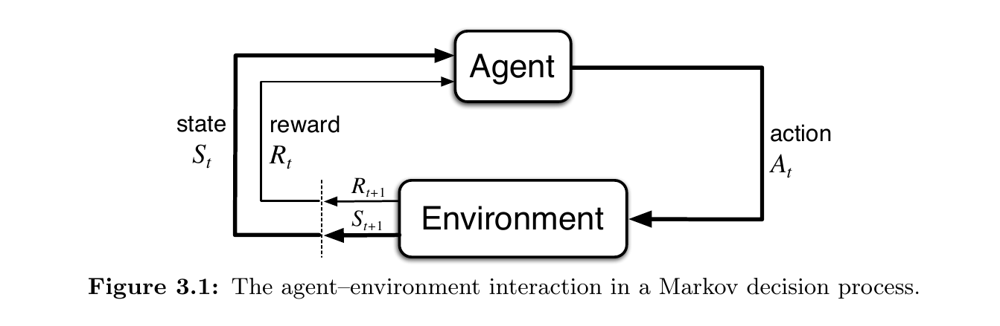
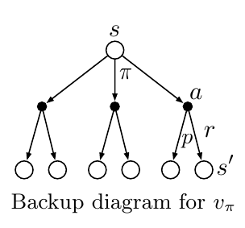



這章談論的問題是 associative aspect: 在不同狀況選擇不同的動作。

MDPs 是一個經典的連續決策的形式，動作會影響當下的獎勵、子序列的狀態，還有未來的獎勵。

權衡:

- immediate reward (當下的獎勵)
- delayed reward (延遲的獎勵)

差異:

- bandit problem: 估計價值 $q_{*}(a)$
- MDPs: 估計
    - 狀態動作價值 $q_{*}(s, a)$
    - 狀態價值 $v_{*}(s)$ (given optimal action selections)

關鍵元素:

- mathematical structure
- returns
- value functions
- Bellman equations

## The Agent-Environment Interface

$$S_0, A_0, R_1, S_1, A_1, R_2, \dots$$

在有限的 MDP, 隨機變數 $R_t$ 和 $S_t$ 有隨機機率分佈只依賴於先前的動作和狀態。

$$p( s^{\prime}, r \mid s, a) \doteq \operatorname{Pr} \lbrace S_{t}=s^{\prime}, R_{t}=r \mid S_{t-1}=s, A_{t-1}=a \rbrace$$

for all $s', s \in \mathcal{S}, r \in \mathcal{R}$, and $a \in \mathcal{A}(s)$.

函數 $p: \mathcal{S} \times \mathcal{R} \times \mathcal{S} \times \mathcal{A} \rightarrow [0, 1]$ 定義了 MDP 的 **dynamics**.

條件機率的符號提醒我們：$p$ 對每個選擇 $s$ 和 $a$ 指定一個機率分佈，也就是:

$$\sum_{s^{\prime} \in \mathcal{S}} \sum_{r \in \mathcal{R}} p (s^{\prime}, r \mid s, a ) = 1, \text { for all } s \in \mathcal{S}, a \in \mathcal{A}(s)$$

$S_t$ 和 $A_t$ 的機率只依賴於先前的狀態和動作, $S_{t-1}$ and $A_{t-1}$.

- 這是一個馬可夫性質 (Markov property)。

對於環境，我們可以計算狀態轉移機率 $p: \mathcal{S} \times \mathcal{S} \times \mathcal{A} \rightarrow [0, 1]$

$$p\left(s^{\prime} \mid s, a\right) \doteq \operatorname{Pr}\lbrace S_{t}=s^{\prime} \mid S_{t-1}=s, A_{t-1}=a\rbrace=\sum_{r \in \mathcal{R}} p\left(s^{\prime}, r \mid s, a\right)$$

計算 狀態-動作 (state-action pairs) 的期望獎勵 (expected rewards) $r: \mathcal{S} \times \mathcal{A} \rightarrow \mathbb{R}$

$$r(s, a) \doteq \mathbb{E}\left[R_{t} \mid S_{t-1}=s, A_{t-1}=a\right]=\sum_{r \in \mathcal{R}} r \sum_{s^{\prime} \in \mathcal{S}} p\left(s^{\prime}, r \mid s, a\right)$$

計算 狀態-動作-下個狀態 (state-action-next-state pairs) 的期望獎勵 $r: \mathcal{S} \times \mathcal{A} \times \mathcal{S} \rightarrow \mathbb{R}$

$$r\left(s, a, s^{\prime}\right) \doteq \mathbb{E}\left[R_{t} \mid S_{t-1}=s, A_{t-1}=a, S_{t}=s^{\prime}\right]=\sum_{r \in \mathcal{R}} r \frac{p\left(s^{\prime}, r \mid s, a\right)}{p\left(s^{\prime} \mid s, a\right)}$$

通用的規則是：任何事情無法被智慧主體任意改變的，都被視為它的外部，也就成為環境的一部分。智慧主體和環境的邊界在於智慧主體的可以絕對控制的範圍。

## Goals and Rewards

Reward hypothesis:

可以把目標視為最大化累積獎勵的期望值。

The reward signal is your way of communicating to the agent what you want to achieve, not how you want it to achieve.

## Returns and Episodes

We have said that the agent’s goal is to maximize the cumulative reward it receives in the long run.

$$G_{t} \doteq R_{t+1}+R_{t+2}+R_{t+3}+\cdots+R_{T}$$

- Return: 獎勵序列的某個特定函數
- Episodes: 當智慧主體和環境的互動自然的分成子序列的時刻
- Terminal state: 每個 episode 在特別的狀態下結束，之後會重整為起始狀態。

### Episodic tasks

有 episode 的任務稱作 episodic tasks。

- non-terminal states: $\mathcal{S}$
- terminal state: $\mathcal{S}^+$
- 終止時間 $T$ 是一個隨機變數，會隨著 episode 變化。

### Continuing tasks

$T=\infty$

Thus, in this book we usually use a definition of return that is slightly more complex conceptually but much simpler mathematically

### Discounting

$$G_{t} \doteq R_{t+1}+\gamma R_{t+2}+\gamma^{2} R_{t+3}+\cdots=\sum_{k=0}^{\infty} \gamma^{k} R_{t+k+1}$$

- $\gamma$: a parameter $0 \le \gamma \le 1$
- $\gamma \lt 1$: $G_t$ is a finite value as long as the reward sequence $\{R_k\}$ is bounded.
    - $R_k$ 數值有上限
- $\gamma = 0$: the agent is myopic
- $\gamma \approx 1$: the agent is farsighted

$$\begin{aligned}
G_{t} & \doteq R_{t+1}+\gamma R_{t+2}+\gamma^{2} R_{t+3}+\gamma^{3} R_{t+4}+\cdots \newline
&=R_{t+1}+\gamma\left(R_{t+2}+\gamma R_{t+3}+\gamma^{2} R_{t+4}+\cdots\right) \newline
&=R_{t+1}+\gamma G_{t+1}
\end{aligned}$$

即使是無限項，reward 還是有限的

e.g. if the reward is constant $+1$

$$G_{t}=\sum_{k=0}^{\infty} \gamma^{k}=\frac{1}{1-\gamma}$$

## Unified Notation for Episodic and Continuing Tasks

可以藉由把 episode termination 是否進入 absorbing state 來統一兩種 tasks

吸收狀態 (absorbing state): 狀態只會轉移到自己，並且產生 0 reward

重新定義 return 的計算，省略了 episode 次數：

$$G_{t} \doteq \sum_{k=t+1}^{T} \gamma^{k-t-1} R_{k}$$

## Policies and Value Functions

Policy: 映射 states 到選擇某個動作的機率

- $\pi (a | s)$

Value functions: 給定 states 或 state-action pairs，估計 agent 的 states 有多好。

- $v_{\pi} (s)$

$$v_{\pi}(s) \doteq \mathbb{E}_{\pi}\left[G_{t} \mid S_{t}=s\right]=\mathbb{E}_{\pi}\left[\sum_{k=0}^{\infty} \gamma^{k} R_{t+k+1} \mid S_{t}=s\right], \text { for all } s \in \mathcal{S}$$

- the state-action-value function for policy $\pi$

$$q_{\pi}(s, a) \doteq \mathbb{E}_{\pi}\left[G_{t} \mid S_{t}=s, A_{t}=a\right]=\mathbb{E}_{\pi}\left[\sum_{k=0}^{\infty} \gamma^{k} R_{t+k+1} \mid S_{t}=s, A_{t}=a\right]$$

- the state-value function for policy $\pi$

$$\begin{aligned}
v_{\pi}(s) & \doteq \mathbb{E}_{\pi}\left[G_{t} \mid S_{t}=s\right] \newline
&=\mathbb{E}_{\pi}\left[R_{t+1}+\gamma G_{t+1} \mid S_{t}=s\right] \newline
&=\sum_{a} \pi(a \mid s) \sum_{s^{\prime}} \sum_{r} p\left(s^{\prime}, r \mid s, a\right)\left[r+\gamma \mathbb{E}_{\pi}\left[G_{t+1} \mid S_{t+1}=s^{\prime}\right]\right] \newline
&=\sum_{a} \pi(a \mid s) \sum_{s^{\prime}, r} p\left(s^{\prime}, r \mid s, a\right)\left[r+\gamma v_{\pi}\left(s^{\prime}\right)\right], \quad \text { for all } s \in \mathcal{S},
\end{aligned}$$

Monte Carlo method: 採樣的次數越多 (趨近於無限)，價值估計就會越準 (收斂)。

一個使用 RL 和 動態規劃的價值函數性質：符合遞迴關係式。

Bellman equation:

$$\begin{aligned}
v_{\pi}(s) & \doteq \mathbb{E}_{\pi}\left[G_{t} \mid S_{t}=s\right] \newline
&=\mathbb{E}_{\pi}\left[R_{t+1}+\gamma G_{t+1} \mid S_{t}=s\right] \newline
&=\sum_{a} \pi(a \mid s) \sum_{s^{\prime}} \sum_{r} p\left(s^{\prime}, r \mid s, a\right)\left[r+\gamma \mathbb{E}_{\pi}\left[G_{t+1} \mid S_{t+1}=s^{\prime}\right]\right] \newline
&=\sum_{a} \pi(a \mid s) \sum_{s^{\prime}, r} p\left(s^{\prime}, r \mid s, a\right)\left[r+\gamma v_{\pi}\left(s^{\prime}\right)\right], \quad \text { for all } s \in \mathcal{S},
\end{aligned}$$

$s^\prime$: 下個狀態

- 空心圓代表一個 state
- 實心圓代表一個 state-action pair

## Optimal Policies and Optimal Value Functions

Optimal policy: $\pi \ge \pi^\prime$ if and only if $v_\pi (s) \ge v_{\pi^\prime} (s)$ for all $s \in \mathcal{S}$

如果超過一個：就把所有的 optimal policies 定義為 $\pi_{*}$

Optimal state-value function:

$$\begin{array}{l}
v_{*}(s) \doteq \max_{\pi}{v_{\pi}(s)} \newline
\text { for all } s \in \mathcal{S} .
\end{array}$$

Optimal action-value function

$$q_{*}(s, a) \doteq \max_{\pi} {q_{\pi}(s, a)},$$

可以用 $v_{*}$ 重寫如下：

$$q_{*}(s, a)=\mathbb{E}\left[R_{t+1}+\gamma v_{*}\left(S_{t+1}\right) \mid S_{t}=s, A_{t}=a\right]$$

## Optimality and Approximation

我們定義了 optimal value functions 和 optimal policies。不過實務上難以使用，因為計算量太大了。即使我們有個精準估計環境的模型，通常也不可能透過解出 Bellman optimality equation 計算一個 optimal policy。

記憶體大小是重要的條件。對於狀態空間小的，可以求出近似解，這種案例稱為 tabular case。實務上，多數的問題涉及更大的狀態，這類的必須要用某種參數化的函數 (parameterized function representation)。
