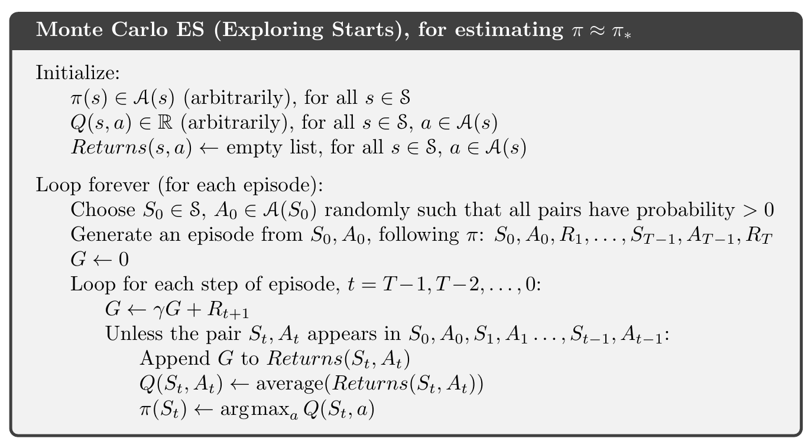
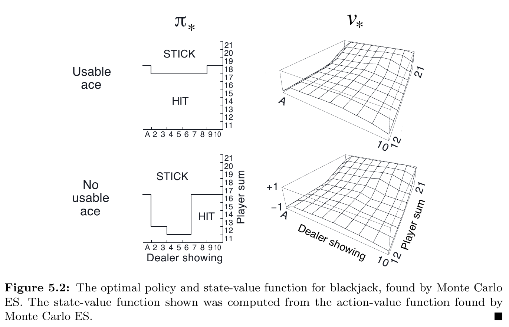



和前面的方法相比之下，Monte Carlo 不假設擁有環境的完整知識。\
Monte Carlo 只憑借「經驗」：從環境互動或是透過模擬來採樣 states, actions, and rewards.\
雖然還是需要環境模型 (model)，但只需要採樣 transitions，而不像 DP 需要完整、所有可能的機率分佈。

Monte Carlo 基於 *averaging sample returns*.\
為了確保 well-defined returns 存在，在此限定問題在 episodic tasks: 可以分成 episodes 且每個 episode 最後會停止。

Monte Carlo 採樣並平均 (sample and average) 每個 state-action pair 的 **returns**，類似於 Ch 2. bandit methods 採樣並平均 **rewards**。\
差異：現在的問題會有多個 states，問題變成 non-stationary。

為了解決 non-stationary 問題，採用 DP 法的 GPI。\
差異：
- DP: 計算 value functions
- MC: 學習 value functions

## Monte Carlo Prediction

問題：給定一個 policy，如何學習 state-value function $v_{\pi}(s)$？\
一個顯而易見的解法：直接採樣 returns 並計算平均值。
- First-visit MC method: the average of the returns following first visits to $s$
  - 詳見下面的演算法
  - 從 1940s 開始已經被大量研究
- Every-visit MC method: averages the returns following all visits to $s$
  - Ch 9 & Ch 12 再討論
  - 不檢查是否第一次探訪 $S_t$

性質：
- 探訪狀態 $s$ 次數趨近無限時，兩種方法都會收斂。
- First-visit MC method 
  - 根據大數法則收斂到它的期望值
  - 每個平均值都是 **unbiased estimate**，標準差為 $\frac{1}{\sqrt{n}}$，$n$ 為 returns 的數量
- Every-visit MC method 以 quadratically (二次函數的) 速率收斂

### Example 5.1: Blackjack

規則：
- 無限牌組（抽完放回）
- 莊家加牌，直到 17 點
- no discount
- usable: 玩家拿到 ace 並且可以計數為 11 點，此時應該跟牌 (hit)
- 假設玩家的 policy 是：拿到 20 或 21 點停止，其餘加注
- 結果以下列數值表示：
  - +1: 贏
  - -1: 輸
  - 0: 平手

## Monte Carlo Estimation of Action Values

如果環境模型不存在，那麼估計 action-values $q_{\pi}(s, a)$ 會比 state-values $v_{\pi}(s)$ 更有效。
- First-visit MC method: 平均每個 episode 第一次遇到的 state-action 的 returns
- Every-visit MC method: 平均所有遇到的 state-action 的 returns

有些 state-action pairs 可能不會遇到。如果 $\pi$ 是確定性的：從每個 state 只會觀察到一個 action，對於沒有 returns 可以平均的 actions， MC 無法從經驗獲得改善。\
為了可以比較，必須估計所有 action 的 value。方法是：在每個 episode 開始時指定一個 state-action pair，強迫所有 pair 都有機會被選擇到。這個方法稱為 ****exploring starts****。

這個方法有時候很有用，除了「和環境模型直接互動」外。這種情況下，最常見的替代方案是只考慮「在每個 state 以非 0 的機率來選擇所有動作」的 policies 來確保所有 state-action pairs 都會遇到。

以下先討論 exploring starts 的假設情況。

## Monte Carlo Control

這一章討論如何把 Monte Carlo estimation 用來近似最佳策略 (optimal policies)。\
整個想法是基於 GPI：以一個迭代的過程，固定 policy 近似 value function，固定 value function 近似 policy。

假設：
- 我們觀察了無限次數 episodes
- 這些 episodes 使用 exploring starts 產生

Policy improvement 會以 policy greedy 並根據目前的 value function 來完成。這種情況下，我們有一個 action-value function，因此不需要 model 來建構 policy greedy。Policy greedy 以決定性的方式選擇最大的 action-value：

$$
\pi(s) \doteq \arg \max _{a} q(s, a)
$$

根據 policy improvement 定理，對所有 $s \in \mathcal{S}$:

$$
\begin{aligned}
q_{\pi_{k}}\left(s, \pi_{k+1}(s)\right) &=q_{\pi_{k}}\left(s, \underset{a}{\arg \max } q_{\pi_{k}}(s, a)\right) \newline
&=\max _{a} q_{\pi_{k}}(s, a) \newline
& \geq q_{\pi_{k}}\left(s, \pi_{k}(s)\right) \newline
& \geq v_{\pi_{k}}(s)
\end{aligned}
$$

每一輪的 policy 都會比上一輪的更好。

接下來討論如何消除第一個假設：觀察 *無限次數* episodes。對 DP 和 MC 兩者來說，都有兩種方式來消除。\
一種方式是給定誤差範圍的大小來計算估計誤差的機率，可以確保在一定數量的步數內會收斂在這個誤差範圍內。不過，有可能需要太多的步數，導致只能套用在極少數的實務應用上。\
另一種方式，是放棄完整的 policy evaluation。一種極端的情形是 value iteration，在每兩個 policy improvement 之間它只會進行一次迭代 iterative policy evaluation。而 in-place 版本的 value iteration 更為極端，它會在 improvement 和 evaluation 迭代一個狀態。

Monte Carlo ES: 對於每個 episode，觀察到的 returns 會拿去算 policy evaluation，然後以該 episode 觀察到所有的 states 進行 policy improvement。完整演算法如下：

（可以用 2.4 的方式進行增量計算）

- Monte Carlo ES 不會收斂到任何 suboptimal policy。
  - 如果發生了，value function 就會到該 policy，導致 policy 改變。
- 只會在 policy 和 value function 都是 optimal 的時候進入穩定。
- 收歛性：雖然看起來無可避免的，隨著時間過去 action-value function 改變量會越來越少，不過還沒有形式化的證明。
  - 以作者的觀點認為這是一個開放的 RL 基礎理論問題。

### Example 5.3: Solving Blackjack

接續 Example 5.1，使用 "20, 21 就停止，其他則跟注" 作為初始的 policy，再以 Monte Carlo ES 找到 optimal policy，結果如下圖：

結果跟 Thorp's strategy 幾乎一致，除了 usable ace 左邊的缺口有所不同。

## Monte Carlo Control without Exploring Starts

## Off-policy Prediction via Importance Sampling

## Incremental Implementation

## Off-policy Monte Carlo Control

## *Discounting-aware Importance Sampling

## *Per-decision Importance Sampling
