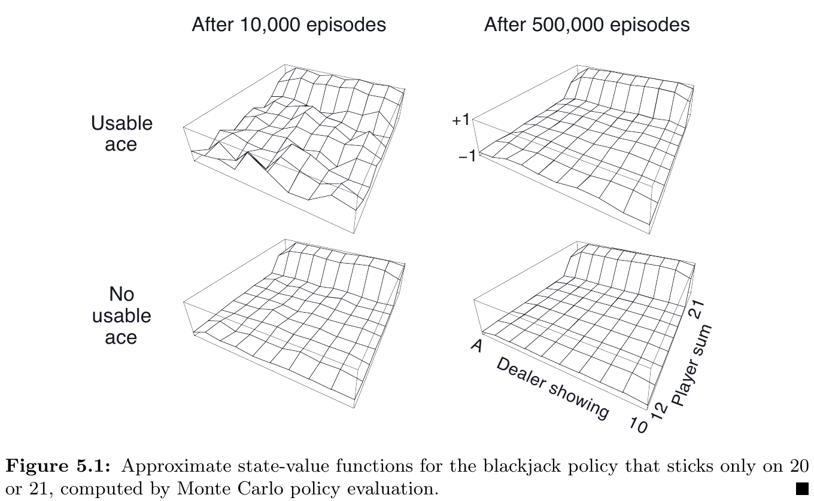



和前面的方法相比之下，Monte Carlo 不假設擁有環境的完整知識。\
Monte Carlo 只憑借「經驗」：從環境互動或是透過模擬來採樣 states, actions, and rewards.\
雖然還是需要環境模型 (model)，但只需要採樣 transitions，而不像 DP 需要完整、所有可能的機率分佈。

Monte Carlo 基於 *averaging sample returns*.\
為了確保 well-defined returns 存在，在此限定問題在 episodic tasks: 可以分成 episodes 且每個 episode 最後會停止。

Monte Carlo 採樣並平均 (sample and average) 每個 state-action pair 的 **returns**，類似於 Ch 2. bandit methods 採樣並平均 **rewards**。\
差異：現在的問題會有多個 states，問題變成 non-stationary。

為了解決 non-stationary 問題，採用 DP 法的 GPI。\
差異：
- DP: 計算 value functions
- MC: 學習 value functions

## Monte Carlo Prediction

問題：給定一個 policy，如何學習 state-value function $v_{\pi}(s)$？\
一個顯而易見的解法：直接採樣 returns 並計算平均值。
- First-visit MC method: the average of the returns following first visits to $s$
  - 詳見下面的演算法
  - 從 1940s 開始已經被大量研究
- Every-visit MC method: averages the returns following all visits to $s$
  - Ch 9 & Ch 12 再討論
  - 不檢查是否第一次探訪 $S_t$

性質：
- 探訪狀態 $s$ 次數趨近無限時，兩種方法都會收斂。
- First-visit MC method 
  - 根據大數法則收斂到它的期望值
  - 每個平均值都是 **unbiased estimate**，標準差為 $\frac{1}{\sqrt{n}}$，$n$ 為 returns 的數量
- Every-visit MC method 以 quadratically (二次函數的) 速率收斂

### Example 5.1: Blackjack

規則：
- 無限牌組（抽完放回）
- 莊家加牌，直到 17 點
- no discount
- usable: 玩家拿到 ace 並且可以計數為 11 點，此時應該跟牌 (hit)
- 結果：
  - +1: 贏
  - -1: 輸
  - 0: 平手

## Monte Carlo Estimation of Action Values

如果環境模型不存在，那麼估計 action-values $q_{\pi}(s, a)$ 會比 state-values $v_{\pi}(s)$ 更有效。
- First-visit MC method: 平均每個 episode 第一次遇到的 state-action 的 returns
- Every-visit MC method: 平均所有遇到的 state-action 的 returns

有些 state-action pairs 可能不會遇到。如果 $\pi$ 是確定性的：從每個 state 只會觀察到一個 action，對於沒有 returns 可以平均的 actions， MC 無法從經驗獲得改善。\
為了可以比較，必須估計所有 action 的 value。方法是：在每個 episode 開始時指定一個 state-action pair，強迫所有 pair 都有機會被選擇到。這個方法稱為 ****exploring starts****。

這個方法有時候很有用，除了「和環境模型直接互動」外。這種情況下，最常見的替代方案是只考慮「在每個 state 以非 0 的機率來選擇所有動作」的 policies 來確保所有 state-action pairs 都會遇到。

以下先討論 exploring starts 的假設情況。

## Monte Carlo Control

## Monte Carlo Control without Exploring Starts

## Off-policy Prediction via Importance Sampling

## Incremental Implementation

## Off-policy Monte Carlo Control

## *Discounting-aware Importance Sampling

## *Per-decision Importance Sampling
