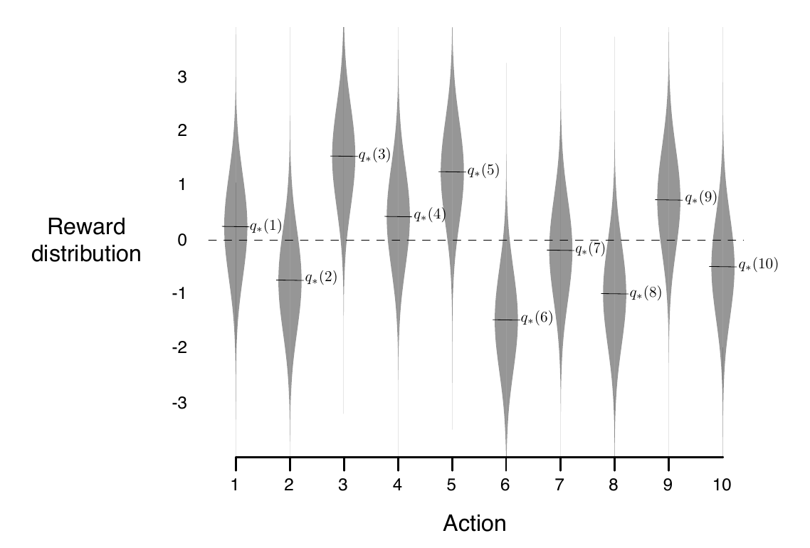
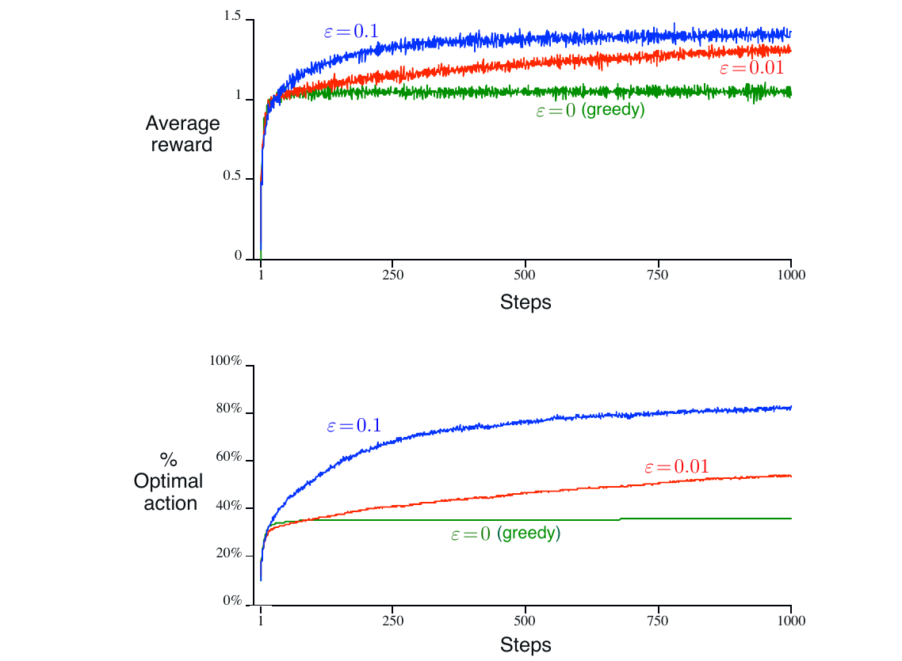



## A k-armed Bandit Problem

*k* 臂吃角子老虎機問題：你需要從 *k* 個不同 選項 或是 動作 中做出選擇，每個選擇都會帶來獎勵，獎勵多寡來自固定的機率分佈。你的目標是要在經過一段時間後得到最大的累積獎勵值。

在這個問題中，每個動作會有期望或平均的獎勵值，讓我們稱之為該動作的 價值。我們把在時間點 $t$ 選擇的動作表示為 $A_t$，對應的獎勵表示為 $R_t$。那麼：任意動作 $a$ 的價值 $q_{*}(a)$ 是選擇該動作的期望值：

$$q_{*}(a) \doteq \mathbb{E}[R_t | A_t = a].$$

我們把 在時間點 $t$ 選擇動作 $a$ 的估計價值表示為 $Q_t(a)$，我們想要此估計值要接近 $q_{*}(a)$。

## Action-value Methods

估計動作的價值，作為根據來做決策，這類的方法通稱為 *action-value methods*。

### Sample-average method

一個自然的方式是計算平均得到多少的獎勵來當作估計值：

$$Q_t(a) \doteq \dfrac{\text{sum of rewards when } a \text{ taken prior to }t}{\text{number of times } a \text{ taken prior to }t} = \dfrac{\sum_{i=1}^{t-1}{R_i \cdot \mathbb{1}_{A_i=a}}}{\sum_{i=1}^{t-1}{\mathbb{1}_{A_i=a}}}$$

其中 $\mathbb{1}_{predicate}$ 表示 $predicate$ 為真時設定為 $1$，否則為 $0$。

- 當分母趨近於 $0$ 的時候，把 $Q_{t}(a)$ 設定為預設值 (例如 $0$)。
- 當分母趨近於無限大時，根據大數法則，$Q_t(a)$ 會收斂於 $q_*(a)$。

### Greedy

最簡單的方法是選擇 最大的估計價值，如下：

$$A_t \doteq \arg \max_{a} Q_t (a)$$

這個方法完全的利用已知的資訊，不採樣任何較差的動作來進行任何探索。

### $\varepsilon$-greedy

一種替代方案是大部分時間都用貪心法，以機率為 $\varepsilon$ 採樣其他的動作來進行少量的探索。

## The 10-armed Testbed

Figure 2.1 為 $k=10$ 的實例，每個都是 $\mathcal{N}(0,1)$ 的常態分佈。

$\varepsilon$-greedy 比 greedy 還要看情況決定

- 如果獎勵的變異數是 10 而非 1，那麼要花費更多的探索才會找到最佳解。
- 如果獎勵的變異數是 0，那麼 greedy 可能會找到最佳解而不需要再探索。
- 如果吃角子老虎機是確定性 (deterministic) 但不穩定的 (nonstationarity)，例如：會隨著時間改變，那麼 $\varepsilon$-greedy 還是比較好。

