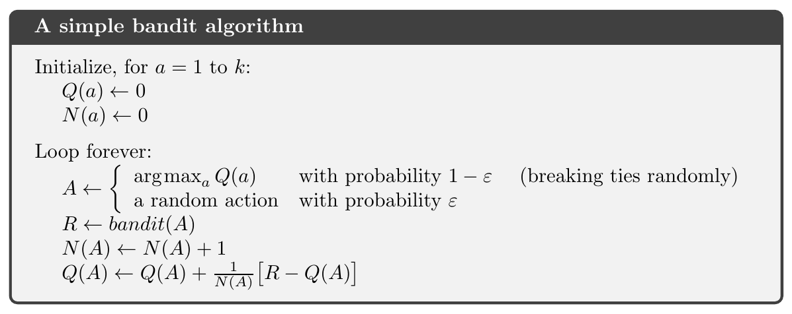



## A k-armed Bandit Problem

*k* 臂吃角子老虎機問題：你需要從 *k* 個不同 選項 或是 動作 中做出選擇，每個選擇都會帶來獎勵，獎勵多寡來自固定的機率分佈。你的目標是要在經過一段時間後得到最大的累積獎勵值。

在這個問題中，每個動作會有期望或平均的獎勵值，讓我們稱之為該動作的 價值。我們把在時間點 $t$ 選擇的動作表示為 $A_t$，對應的獎勵表示為 $R_t$。那麼：任意動作 $a$ 的價值 $q_{*}(a)$ 是選擇該動作的期望值：

$$q_{*}(a) \doteq \mathbb{E}[R_t | A_t = a].$$

我們把 在時間點 $t$ 選擇動作 $a$ 的估計價值表示為 $Q_t(a)$，我們想要此估計值要接近 $q_{*}(a)$。

## Action-value Methods

估計動作的價值，作為根據來做決策，這類的方法通稱為 *action-value methods*。

### Sample-average method

一個自然的方式是計算平均得到多少的獎勵來當作估計值：

$$Q_t(a) \doteq \dfrac{\text{sum of rewards when } a \text{ taken prior to }t}{\text{number of times } a \text{ taken prior to }t} = \dfrac{\sum_{i=1}^{t-1}{R_i \cdot \mathbb{1}_{A_i=a}}}{\sum_{i=1}^{t-1}{\mathbb{1}_{A_i=a}}}$$

其中 $\mathbb{1}_{predicate}$ 表示 $predicate$ 為真時設定為 $1$，否則為 $0$。

- 當分母趨近於 $0$ 的時候，把 $Q_{t}(a)$ 設定為預設值 (例如 $0$)。
- 當分母趨近於無限大時，根據大數法則，$Q_t(a)$ 會收斂於 $q_*(a)$。

### Greedy

最簡單的方法是選擇 最大的估計價值，如下：

$$A_t \doteq \arg \max_{a} Q_t (a)$$

這個方法完全的利用已知的資訊，不採樣任何較差的動作來進行任何探索。

### $\varepsilon$-greedy

一種替代方案是大部分時間都用貪心法，以機率為 $\varepsilon$ 採樣其他的動作來進行少量的探索。

## The 10-armed Testbed

Figure 2.1 為 $k=10$ 的實例，每個都是 $\mathcal{N}(0,1)$ 的常態分佈。

$\varepsilon$-greedy 比 greedy 還要看情況決定

- 如果獎勵的變異數是 10 而非 1，那麼要花費更多的探索才會找到最佳解。
- 如果獎勵的變異數是 0，那麼 greedy 可能會找到最佳解而不需要再探索。
- 如果吃角子老虎機是確定性 (deterministic) 但不固定的 (nonstationarity)，例如：會隨著時間改變，那麼 $\varepsilon$-greedy 還是比較好。

## Incremental Implementation

以上都是以 平均獎勵值 來估計 價值。以下討論如何以更有效率的方式計算。

設 $R_{i}$ 為當前動作中第 $i$ 個選擇接收的獎勵值，$Q_n$ 為這個動作第 $n-1$ 次選擇後的估計價值，可以簡寫如下：

$$Q_n \doteq \dfrac{R_1 + R_2 + \ldots + R_{n-1}}{n-1}$$

 計算複雜度會隨著次數越來越多次以後變得更多。可以改寫為遞迴式：

$$
\begin{aligned}
Q_{n+1} 
&= \frac{1}{n} \sum_{i=1}^{n} R_{i}\newline
&= \frac{1}{n}\left(R_{n}+\sum_{i=1}^{n-1} R_{i}\right)\newline
&=\frac{1}{n}\left(R_{n}+(n-1) \frac{1}{n-1} \sum_{i=1}^{n-1} R_{i}\right)\newline
&=\frac{1}{n}\left(R_{n}+(n-1) Q_{n}\right)\newline
&=\frac{1}{n}\left(R_{n}+n Q_{n}-Q_{n}\right)\newline
&=Q_{n}+\frac{1}{n}\left[R_{n}-Q_{n}\right],\newline
\end{aligned}
$$

通用形式如下：

$$\text{NewEstimate} \leftarrow \text{OldEstimate} + \text{StepSize}[\text{Target} - \text{OldEstimate}]$$

其中 $\text{Target} - \text{OldEstimate}$ 為 **誤差**，$\text{StepSize}$ 為 **步長**，通常以符號 $\alpha$ 或 $\alpha_{t}(a)$ 表示。

增量法的完整演算法如下：

## Tracking a Nonstationary Problem

以上方法適用於固定的 (stationary) 吃角子老虎機問題，也就是獲得的 獎勵值 不會隨著時間改變。為了計算不固定 (nonstationary) 的問題，通常會為每一步給個 **權重值**，可以經由 $\text{StepSize}$ $\alpha$ 給定。

例如：原增量法的計算式如下：

$$Q_{n+1} \doteq Q_{n}+\alpha\left[R_{n}-Q_{n}\right]$$

其中 $\alpha \in (0, 1]$ 為常數。那麼展開後的 價值 為過去 獎勵值 的 **加權平均** (weighted average)，結果計算如下 (2.6)：

$$\begin{aligned}
Q_{n+1} &=Q_{n}+\alpha\left[R_{n}-Q_{n}\right] \newline
&=\alpha R_{n}+(1-\alpha) Q_{n} \newline
&=\alpha R_{n}+(1-\alpha)\left[\alpha R_{n-1}+(1-\alpha) Q_{n-1}\right] \newline
&=\alpha R_{n}+(1-\alpha) \alpha R_{n-1}+(1-\alpha)^{2} Q_{n-1} \newline
&=\alpha R_{n}+(1-\alpha) \alpha R_{n-1}+(1-\alpha)^{2} \alpha R_{n-2}+\newline
& \quad \cdots+(1-\alpha)^{n-1} \alpha R_{1}+(1-\alpha)^{n} Q_{1} \newline
&=(1-\alpha)^{n} Q_{1}+\sum_{i=1}^{n} \alpha(1-\alpha)^{n-i} R_{i}
\end{aligned}$$

稱為加權平均是因為 $(1-\alpha)^{n}+\sum_{i=1}^{n} \alpha(1-\alpha)^{n-i}=1$。

- $(1 - \alpha) < 1$: 所以給予過去探索的獎勵值 $R_i$ 權重會越來越小
- 當 $(1 - \alpha) < 0$:  稱為 exponential recency-weighted average
- 當 $(1 - \alpha) = 0$: 所有權重都會給最近的獎勵值。

### 可變長度的步長 (step-size)

設 在第 $n$ 個選擇了動作 $a$ 之後的步長 (step-size) 為 $\alpha_n (a)$

- $\alpha_n (a) = \dfrac{1}{n}$: 採樣平均法 (sample-average method)，根據大數法則 (the law of large numbers) 保證收斂到真實的動作價值。
- $\sum_{n=1}^\infty \alpha_n (a) = \infty \text{ and } \sum_{n=1}^\infty \alpha_n^2 (a) < \infty$: 根據隨機近似理論 (stochastic approximation theory) 符合條件保證收斂到機率為 $1$。
    - 第一個條件保證步長總和大到可以克服任意初始條件和隨機波動。
    - 第二個條件保證最後步長足夠小到可以收斂。

問題：

- 雖然保證收斂，但是收斂速度緩慢，或是要經過調整才能得到良好的收斂率。
- 理論上可行，實務上很少使用。

## Optimistic Initial Value

以上的方法都依賴於初始的動作價值 (initial action-value) $Q_1(a)$。在統計學裡，這稱為 **偏差** (*biased* by their initial estimates)。

- 在採樣平均法中，偏差會在所有動作至少採樣過一次以後消失。
- 在所有 $\alpha$ 為常數的方法，根據 2.6 式，偏差會隨著時間削減但永久存在。
    - 壞處：初始值成為一種使用者設定的參數，除非把它們設定為 $0$。
    - 好處：以一種簡單的方式提供某種先驗的知識，告訴我們預期可以得到什麼程度的獎勵值。

初始動作價值也可以用來 **鼓勵探索**。假設不把初始值設定為 $0$，在 10-armed testbed 中把所有都設定成 $+5$，而 $q_*(a)$ 在先前設定為平均為 $0$ 變異數為 $1$ 的常態分佈。

1. 這種情況下，初始的估計值都是 $+5$ 是樂觀的 (optimistic)，這種樂觀會鼓勵 動作價值法 去探索。
2. 不論選擇哪個動作，獎勵值都會少於估計值，學習器 (learner) 會對獎勵值失望 (disappointed)。
3. 所有動作在嘗試幾次以後收斂。

下圖為 10-armed testbed 比較兩種設定 ($\alpha = 0.1$)：

- greedy: $Q_1(a) = +5$
- $\varepsilon$-greedy: $Q_1(a) = 0$

它是一個簡單的技巧，但是不適用於不固定問題 (nonstationary problems)。

- 當任務改變時，需要開啟新的探索，這個方法就會無效。

## Upper-Confidence-Bound Action Selection

因為不確定 動作價值 (action-value) 估計值的準確度，所以需要 **探索**。問題是如何選擇可能最好的動作？以下提供一個有效的方式：

$$A_{t} \doteq \underset{a}{\arg \max }\left[Q_{t}(a)+c \sqrt{\frac{\ln t}{N_{t}(a)}}\right],$$

- $N_t(a)$ 表示動作 $a$ 隨著時間 $t$ 經過後採樣的次數。
- $c > 0$ 用來控制探索的程度。
- 平方根內的值用來測量動作 $a$ 的不確定性 (uncertainty) 或 變異數 (variance)。

下圖為 10-armed testbed 比較兩種設定：

- UCB: $c = 2$
- $\varepsilon$-greedy: $\varepsilon = 0.1$

解決更通用的 RL 問題的困難：

- 處理不固定問題 (nonstationary problems) 方法更複雜。
- 處理更大的狀態空間 (state spaces)。

## Gradient Bandit Algorithms

先前的作法是估計動作價值之後根據這些估計值來選擇動作。

這節的作法是學習一個動作的 **偏好** (*preference*)，表示為 $H_t (a) \in \mathbb{R}$。

- 偏好跟獎勵值無關。
- 偏好是相對的。如果對所有偏好都增加 $1000$，根據 *soft-max* 將不影響計算結果：

$$
\operatorname{Pr}\\{A_{t}=a \\} \doteq \frac{e^{H_{t}(a)}}{\sum_{b=1}^{k} e^{H_{t}(b)}} \doteq \pi_{t}(a)
$$

使用 stochastic gradient ascent 來更新偏好值：

$$\begin{aligned}
H_{t+1}\left(A_{t}\right) & \doteq H_{t}\left(A_{t}\right)+\alpha\left(R_{t}-\bar{R}_{t}\right)\left(1-\pi_{t}\left(A_{t}\right)\right), & & \text { and } \newline
H_{t+1}(a) & \doteq H_{t}(a)-\alpha\left(R_{t}-\bar{R}_{t}\right) \pi_{t}(a), & & \text { for all } a \neq A_{t},
\end{aligned}$$

- $\alpha > 0$: 步長 (step-size) 參數。
- $\bar{R}_t \in \mathbb{R}$: 平均但不包含時間點 $t$ 的獎勵值，通常當作比較基準 (baseline)。
    - 如果獎勵比基準大，未來選擇動作 $A_t$ 的機率會增加；否則就降低。
- 原本應該要計算的梯度: $\dfrac{\partial \pi_t(x)}{\partial H_t(a)} = \pi_t(x)(\mathbb{1}_{a=x} - \pi_t(a))$ (證明略)

下圖為 10-armed testbed $\mathcal{N}(4,1)$ 比較兩種設定：

- 包含 baseline
- 不含 baseline ($\bar{R}_t = 0$)

## Associative Search (Contextual Bandits)

目前為止考慮的都是非結合式的任務 (nonassociative tasks)，不需要在不同情況下結合不同的動作。更通用的 RL 任務是學習一個策略 (policy)：從一個狀態映射到一個最好的動作選項 (a mapping from situations to the actions that are best in those situations)。

舉例：

- 假設有幾個不同的 k-armed 吃角子老虎機任務。
- 每一步都是隨機的。
- 假設機器是可以辨識的，例如當他改變動作價值 (action values) 時你會知道顏色。
- 目標是要學習策略來結合每個任務，根據你看到的顏色，選擇當前任務最好的動作。

在文獻中也稱為 *contextual bandits*。

## Summary

- *k*-armed Bandit Problem
    - $\varepsilon$-greedy 隨機性的探索不同動作
    - greedy with optimistic initialization 利用初始值來當作探索策略
    - UCB 確定性的選擇，並且計算採樣過的動作的不確定性來取得平衡
    - Gradient bandit algorithm 估計動作偏好 (action preference) 而非動作價值

下圖為各個方法在控制不同參數過後平均取得的獎勵值：

