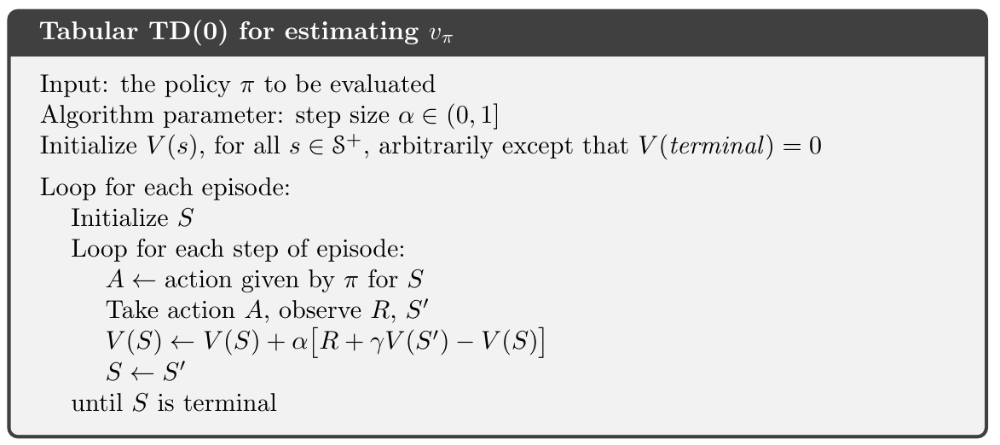

Temporal-difference (TD) learning 是一個 RL 新穎且重要的觀念，它結合 Monte Carlo 和 dynamic programming (DP) 的想法。
- Monte Carlo: 類似於 Monte Carlo，TD 法可以直接從原始經驗學習，而不需要環境模型。
- DP: 類似於 DP，TD 法可以從另一個已學習的估計來更新估計值，而不用等最後結果。



## TD Prediction

一個 every-visit Monte Carlo 適用於 nonstationary 的環境，value function 更新如下：

$$
V\left(S_{t}\right) \leftarrow V\left(S_{t}\right)+\alpha\left[G_{t}-V\left(S_{t}\right)\right]
$$
- $G_t$: return following $t$
- $\alpha$: step-size

這個稱為 constant-$\alpha$ MC。Monte Carlo 法必須等到 episode 結束以後才能更新 $V(S_t)$。因此，TD 法概念是希望可以在每個 time step 都能進行更新。最簡單的 TD 形式如下：

$$
V\left(S_{t}\right) \leftarrow V\left(S_{t}\right)+\alpha\left[R_{t+1}+\gamma V\left(S_{t+1}\right)-V\left(S_{t}\right)\right]
$$

稱為 TD(0) 或 one-step TD。因為 TD(0) 基於現有的估計值進行更新，所以它是一種 bootstrapping 法，像是 DP。

比較：
- Monte Carlo: 更新的目標是 $G_t$
- TD: 更新的目標是 $R_{t+1} + \gamma V(S_{t+1})$

$$
\begin{aligned}
v_{\pi}(s) & \doteq \mathbb{E}_{\pi}\left[G_{t} \mid S_{t}=s\right] \newline
&=\mathbb{E}_{\pi}\left[R_{t+1}+\gamma G_{t+1} \mid S_{t}=s\right] \newline
&=\mathbb{E}_{\pi}\left[R_{t+1}+\gamma v_{\pi}\left(S_{t+1}\right) \mid S_{t}=s\right]
\end{aligned}
$$
- Monte Carlo 使用第一式的估計值當作目標。因為
- DP 使用第三式的估計值當作目標

... (?)

TD(0) 更新值是一種誤差，這個值稱為 TD error:

$$
\delta_{t} \doteq R_{t+1}+\gamma V\left(S_{t+1}\right)-V\left(S_{t}\right)
$$

- TD error 每個時刻的當下產生。但 TD error 相依於下次的 state 和 reward，它要到下一個 time step 才會存在。
- 如果 $V$ 在 episode 期間不會改變，那麼 Monte Carlo error 可以寫成 TD error 的和：

$$
\begin{aligned}
G_{t}-V\left(S_{t}\right) &=R_{t+1}+\gamma G_{t+1}-V\left(S_{t}\right)+\gamma V\left(S_{t+1}\right)-\gamma V\left(S_{t+1}\right) \quad(\text { from }(3.9)) \newline
&=\delta_{t}+\gamma\left(G_{t+1}-V\left(S_{t+1}\right)\right) \newline
&=\delta_{t}+\gamma \delta_{t+1}+\gamma^{2}\left(G_{t+2}-V\left(S_{t+2}\right)\right) \newline
&=\delta_{t}+\gamma \delta_{t+1}+\gamma^{2} \delta_{t+2}+\cdots+\gamma^{T-t-1} \delta_{T-1}+\gamma^{T-t}\left(G_{T}-V\left(S_{T}\right)\right) \newline
&=\delta_{t}+\gamma \delta_{t+1}+\gamma^{2} \delta_{t+2}+\cdots+\gamma^{T-t-1} \delta_{T-1}+\gamma^{T-t}(0-0) \newline
&=\sum_{k=t}^{T-1} \gamma^{k-t} \delta_{k}
\end{aligned}
$$

- 如果 $V$ 在 episode 期間會改變，這個等式就不精確，不過 step size 夠小的話還是很接近。
