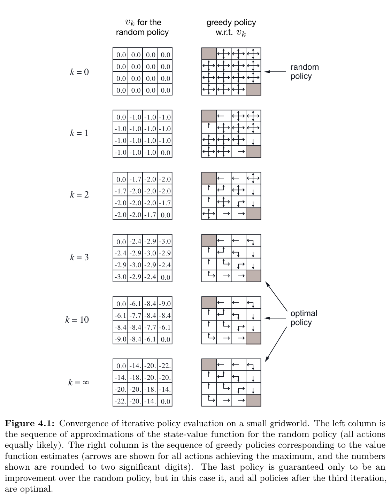
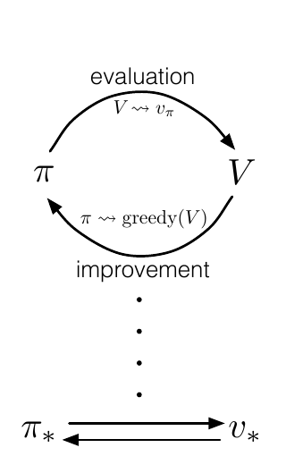
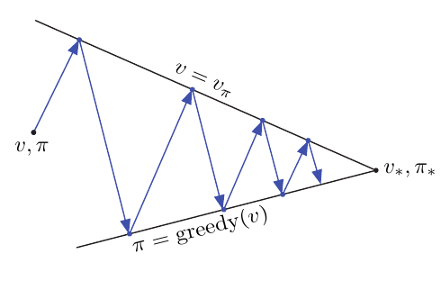



Dynamic programming (DP, 動態規劃): a collection of algorithms that can be used to compute optimal policies given a perfect model of the environment as a Markov decision process (MDP).

DP 的限制：

- 假設一個完美的環境模型
- 消耗龐大的運算量

通常也會假設環境是一個 finite MDP (有限馬可夫決策過程)。

DP 的核心觀念：使用價值函數來組織並結構化「尋找好的策略」。

## Policy Evaluation (Prediction)

Policy evaluation: 如何為任意的策略 $\pi$ 計算 狀態-價值函數 $v_{\pi}$

$$
\begin{aligned}
v_{\pi}(s) & \doteq \mathbb{E}_{\pi}\left[G_{t} \mid S_{t}=s\right] \newline
&=\mathbb{E}_{\pi}\left[R_{t+1}+\gamma G_{t+1} \mid S_{t}=s\right] \newline
&=\mathbb{E}_{\pi}\left[R_{t+1}+\gamma v_{\pi}\left(S_{t+1}\right) \mid S_{t}=s\right] \newline
&=\sum_{a} \pi(a \mid s) \sum_{s^{\prime}, r} p\left(s^{\prime}, r \mid s, a\right)\left[r+\gamma v_{\pi}\left(s^{\prime}\right)\right]
\end{aligned}
$$

$v_{\pi}$ 保證存在且唯一的條件 (任一):

- $\gamma < 1$
- 從策略 $\pi$ 之下的所有狀態，最後會進入中止狀態

如果環境的動態是完全已知的，那麼 (4.4) 式是一個 $| \mathcal{S} |$ 未知的聯立線性方程 (simultaneous linear equations) ($v_{\pi}, s \in \mathcal{S}$)

- (4.4): $v_{\pi}(s)=\sum_{a} \pi(a \mid s) \sum_{s^{\prime}, r} p\left(s^{\prime}, r \mid s, a\right)\left[r+\gamma v_{\pi}\left(s^{\prime}\right)\right]$
- 這種情況可以直接求解 (tedious)

### Iterative policy evaluation (迭代策略評估)

迭代解法會更適用 RL 的情境。

考慮到一個近似價值函數的序列 $v_0, v_1, v_2, \dots,$ 每個映射 $\mathcal{S}^+$ 到 $\mathbb{R}$。
選定任意初始價值 $v_0$ (除了中止狀態必須給值為 0)，對所有狀態 $s \in \mathcal{S}$，可以利用 Bellman equation (4.4) 進行連續近似：

$$
\begin{aligned} v_{k+1}(s) & \doteq \mathbb{E}_{\pi}\left[R_{t+1}+\gamma v_{k}\left(S_{t+1}\right) \mid S_{t}=s\right] \newline &=\sum_{a} \pi(a \mid s) \sum_{s^{\prime}, r} p\left(s^{\prime}, r \mid s, a\right)\left[r+\gamma v_{k}\left(s^{\prime}\right)\right] \end{aligned}
$$

- 當 $k \rightarrow \infty$ 時， $\lbrace v_k \rbrace$ 收斂到 $v_{\pi}$

為了產生每個連續的近似，迭代策略評估對每個狀態 $s$ 套用相同的操作：

- 利用 期望立即獎勵 (expected immediate rewards)，在被評估的策略下，沿著所有可能的單步狀態轉移 (one-step transitions)，以新的狀態價值取代舊的。

這個操作稱為 **期望更新** (expected update)。

- 對所有可能的狀態計算期望值，而非採樣一個狀態。


**Iterative Policy Evaluation, for estimating** $V \approx v_{\pi}$

Input $\pi$, the policy to be evaluated 

Algorithm parameter: 
- a small threshold $\theta > 0$ determining accuracy of estimation 

Initialize $V(s)$, for all $s \in \mathcal{S}^{+}$, arbitrarily except that $V( terminal )=0$
1. Loop:
2. ... $\Delta \leftarrow 0$
3. ... Loop for each $s \in \mathcal{S}:$
4. ... ... $v \leftarrow V(s)$
5. ... ... $V(s) \leftarrow \sum_{a} \pi(a \mid s) \sum_{s^{\prime}, r} p\left(s^{\prime}, r \mid s, a\right)\left[r+\gamma V\left(s^{\prime}\right)\right]$
6. ... ... $\Delta \leftarrow \max (\Delta,|v-V(s)|)$
7. until $\Delta<\theta$


## Policy Improvement

計算 價值函數 是為了找到更好的 策略。

假設我們已經決定了 價值函數 $v_{\pi}$ 對任意確定性的策略 $\pi$。\
對某個狀態 $s$ 我們可能想知道是否我們應該改變策略來確定性的選擇一個動作 $a \neq \pi(s)$。\
我們想知道 $v_{\pi}(s)$ 有多好，但改變策略可能會變得更好或更壞。

一種方式是：考慮在狀態 $s$ 之下選擇一個動作 $a$，經由目前的策略 $\pi$。這種情況下，價值為：

$$
\begin{aligned}q_{\pi}(s, a) & \doteq \mathbb{E}\left[R_{t+1}+\gamma v_{\pi}\left(S_{t+1}\right) \mid S_{t}=s, A_{t}=a\right] \newline
&=\sum_{s^{\prime}, r} p\left(s^{\prime}, r \mid s, a\right)\left[r+\gamma v_{\pi}\left(s^{\prime}\right)\right]\end{aligned}
$$

這個價值比 $v_{\pi}(s)$ 大或小？如果比較大，代表在狀態 $s$ 下，選擇動作 $a$ 會有較大的價值。

### Policy improvement theorem

Let $\pi$ and $\pi^\prime$ be any pair of deterministic policies such that, for all $s \in \mathcal{S}$, (4.7):

$$q_{\pi}\left(s, \pi^{\prime}(s)\right) \geq v_{\pi}(s)$$

Then the policy $\pi^\prime$ must be as good as, or better than, $\pi$. That is, it must obtain greater or equal expected return from all states $s \in \mathcal{S}$, (4.8):

$$v_{\pi^{\prime}}(s) \geq v_{\pi}(s)$$

Moreover, if there is strict inequality of (4.7) at any state, then there must be strict inequality of (4.8) at that state.

$$\begin{aligned}v_{\pi}(s) & \leq q_{\pi}\left(s, \pi^{\prime}(s)\right) \newline&=\mathbb{E}\left[R_{t+1}+\gamma v_{\pi}\left(S_{t+1}\right) \mid S_{t}=s, A_{t}=\pi^{\prime}(s)\right] \newline&=\mathbb{E}_{\pi^{\prime}}\left[R_{t+1}+\gamma v_{\pi}\left(S_{t+1}\right) \mid S_{t}=s\right] \newline& \leq \mathbb{E}_{\pi^{\prime}}\left[R_{t+1}+\gamma q_{\pi}\left(S_{t+1}, \pi^{\prime}\left(S_{t+1}\right)\right) \mid S_{t}=s\right] \newline&=\mathbb{E}_{\pi^{\prime}}\left[R_{t+1}+\gamma \mathbb{E}\left[R_{t+2}+\gamma v_{\pi}\left(S_{t+2}\right) \mid S_{t+1}, A_{t+1}=\pi^{\prime}\left(S_{t+1}\right)\right] \mid S_{t}=s\right] \newline&=\mathbb{E}_{\pi^{\prime}}\left[R_{t+1}+\gamma R_{t+2}+\gamma^{2} v_{\pi}\left(S_{t+2}\right) \mid S_{t}=s\right] \newline& \leq \mathbb{E}_{\pi^{\prime}}\left[R_{t+1}+\gamma R_{t+2}+\gamma^{2} R_{t+3}+\gamma^{3} v_{\pi}\left(S_{t+3}\right) \mid S_{t}=s\right] \newline& \vdots \newline& \leq \mathbb{E}_{\pi^{\prime}}\left[R_{t+1}+\gamma R_{t+2}+\gamma^{2} R_{t+3}+\gamma^{3} R_{t+4}+\cdots \mid S_{t}=s\right] \newline&=v_{\pi^{\prime}}(s) .\end{aligned}$$

考慮新的 greedy 策略 $\pi^\prime$

$$\begin{aligned}\pi^{\prime}(s) & \doteq \underset{a}{\arg \max } q_{\pi}(s, a) \newline&=\underset{a}{\arg \max } \mathbb{E}\left[R_{t+1}+\gamma v_{\pi}\left(S_{t+1}\right) \mid S_{t}=s, A_{t}=a\right] \newline&=\underset{a}{\arg \max } \sum_{s^{\prime}, r} p\left(s^{\prime}, r \mid s, a\right)\left[r+\gamma v_{\pi}\left(s^{\prime}\right)\right]\end{aligned}$$

這個 greedy 策略執行一步後，根據最好的價值 $v_{\pi}$ 來採取動作。

上面討論的是確定性的策略，對於隨機性的策略可以很輕易的由此擴展。圖 4.1 是一個隨機性策略的更新例子。

## Policy Iteration

一個策略 $\pi$ 經由價值函數 $v_{\pi}$ 產生更好的策略 $\pi^\prime$，之後進一步計算新的價值函數與更好的策略...由此可以得到一個序列：

$$
\pi_{0} \stackrel{\mathrm{E}}{\longrightarrow} v_{\pi_{0}} \stackrel{\mathrm{I}}{\longrightarrow} \pi_{1} \stackrel{\mathrm{E}}{\longrightarrow} v_{\pi_{1}} \stackrel{\mathrm{I}}{\longrightarrow} \pi_{2} \stackrel{\mathrm{E}}{\longrightarrow} \cdots \stackrel{\mathrm{I}}{\longrightarrow} \pi_{*} \stackrel{\mathrm{E}}{\longrightarrow} v_{*}
$$

其中 $\mathrm{E}$ 表示為 evaluation，$\mathrm{I}$ 表示為 improvement。

由於 finite MDP 只會有有限個策略數量，這個過程必定在有限的迭代次數收斂到最佳的策略和價值函數。這個尋找最佳策略的方法稱為 policy iteration。這個方法大幅提昇 policy evaluation 的收斂速度。


**Policy Iteration (using iterative policy evaluation) for estimating** $\pi \approx \pi_{*}$

1. Initialization\
    $V(s) \in \mathbb{R}$ and $\pi(s) \in \mathcal{A}(s)$ arbitrarily for all $s \in \mathcal{S}$
2. Policy Evaluation
    1. Loop:
    2. ... $\Delta \leftarrow 0$
    3. ... ... Loop for each $s \in \mathcal{S}$:
    4. ... ... $v \leftarrow V(s)$
    5. ... ... $V(s) \leftarrow \sum_{s^{\prime}, r} p\left(s^{\prime}, r \mid s, \pi(s)\right)\left[r+\gamma V\left(s^{\prime}\right)\right]$
    6. ... ... $\Delta \leftarrow \max (\Delta,|v-V(s)|)$
    7. until $\Delta<\theta$ (a small positive number determining the accuracy of estimation)
3. Policy Improvement 
   1. $policy--stable$ $\leftarrow$ true
   2. For each $s \in \mathcal{S}$:
   3. ... old-action $\leftarrow \pi(s)$
   4. ... $\pi(s) \leftarrow \arg \max_ {a} \sum_{s^{\prime}, r} p\left(s^{\prime}, r \mid s, a\right)\left[r+\gamma V\left(s^{\prime}\right)\right]$
   5. ... If old-action $\neq \pi(s)$, then $policy--stable$ $\leftarrow$ false 
   6. If $policy--stable$, then 
   7. ... stop and return $V \approx v_{*}$ and $\pi \approx \pi_{*} ;$ 
   8. else
   9. ... go to 2 


## Value Iteration

Policy iteration 的一個缺陷是迭代涉及 policy evaluation，這需要多次的 sweep (採訪所有狀態後進行更新)，導致計算緩慢。從圖 4.1 可以得到一點線索，或許可以裁剪 policy evaluation，因為在第三次以後 policy evaluation 就不會再改變 policy。裁剪並不破壞收斂性的方式有很多種，最重要的一種方式稱為 value iteration (價值迭代) (4.10):

$$\begin{aligned}v_{k+1}(s) & \doteq \max _{a} \mathbb{E}\left[R_{t+1}+\gamma v_{k}\left(S_{t+1}\right) \mid S_{t}=s, A_{t}=a\right] \newline&=\max _{a} \sum_{s^{\prime}, r} p\left(s^{\prime}, r \mid s, a\right)\left[r+\gamma v_{k}\left(s^{\prime}\right)\right]\end{aligned}$$

保證存在 optimal value $v_{*}$ 的條件下，$\lbrace v_k \rbrace$ 最後會收斂到 $v_{*}$。


**Value Iteration, for estimating** $\pi \approx \pi_{*}$

Algorithm parameter: a small threshold $\theta>0$ determining accuracy of estimation

Initialize $V(s)$, for all $s \in \mathcal{S}^{+}$, arbitrarily except that $V(terminal)=0$

1. Loop:
2. ... $\Delta \leftarrow 0$
3. ... Loop for each $s \in \mathcal{S}$:
4. ... ... $v \leftarrow V(s)$
5. ... ... $V(s) \leftarrow \max_{a} \sum_{s^{\prime}, r} p\left(s^{\prime}, r \mid s, a\right)\left[r+\gamma V\left(s^{\prime}\right)\right]$
6. ... ... $\Delta \leftarrow \max (\Delta,|v-V(s)|)$
7. until $\Delta<\theta$

Output a deterministic policy, $\pi \approx \pi_{*}$, such that\
  $\pi(s)=\arg \max_{a} \sum_{s^{\prime}, r} p\left(s^{\prime}, r \mid s, a\right)\left[r+\gamma V\left(s^{\prime}\right)\right]$


## Asynchronous Dynamic Programming

DP 法主要的缺陷是涉及 sweep 整個狀態集。如果整個狀態集非常大，就會需要昂貴運算量。非同步的 DP 

## Generalized Policy Iteration (GPI)

Policy iteration 包含兩個同時、互動的過程：

- Policy evaluation: 讓價值函數和目前的策略一致
- Policy improvement: 讓 policy greedy 考慮目前的價值函數

## Efficiency of Dynamic Programming

DP 在大多數的問題上並不實用，但是相較其他解決 MDPs 的方法，DP 非常有效率。在 worst case，DP 找到最佳策略的時間保證是狀態與動作數量的多項式函數，即使 (決定性的) 策略的總數是 $k^n$。

LP (Linear Programming, 線性規劃) 也能解決 MDPs。在某些情況下，它的 worst-case 保證收斂的比 DP 更好。但是 LP 實務上可以解決的狀態數比 DP 更少 (相差大約 100 倍)。在大型問題上，只有 DP 可行。

由於維度災難 (curse of dimensionality)，DP 被認為適用性很受限。不過在狀態數量較大的問題上，它們是本質上困難的，並不限於 DP 解法。這類問題使用 DP 都還是比直接搜尋和 LP 解法來得更好。

## Summary

- Policy evaluation: 一種計算方式，迭代式的計算價值 $v_{\pi}$ 給定一個策略 $\pi$。
- Policy improvement: 一種計算方式，用來改善策略 $\pi$ 給定價值函數 $v_{\pi}$。
- Policy iteration
- Value iteration

對於有限的馬可夫決策過程，這些方法可以用來求出最佳策略和價值函數。

- expected update: 根據所有可能的狀態和它們的發生機率，來更新一個狀態的價值。
- Generalized policy iteration (GPI): 一種通用的想法，兩個互動的過程圍繞著近似策略和近似價值函數。幾乎所有 RL 方法都可以被視為 GPI。
- Asynchronous DP: 一種 in-place 的迭代方法，以任意的順序更新狀態。
