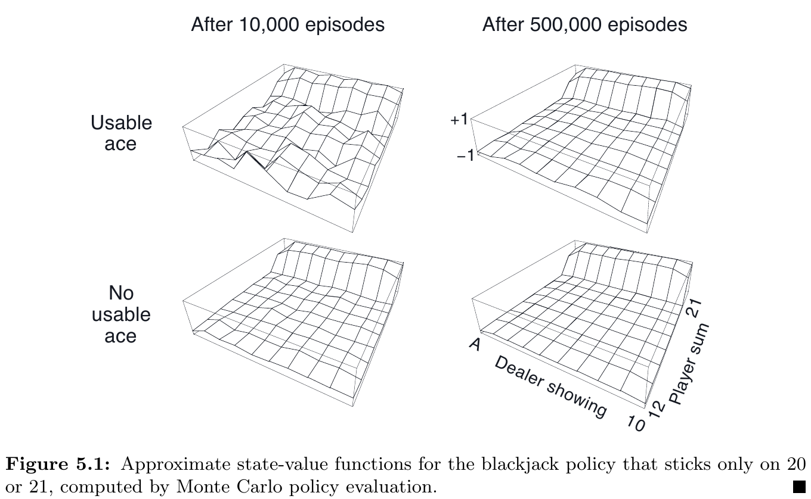



和前面的方法相比之下，Monte Carlo 不假設擁有環境的完整知識。\
Monte Carlo 只憑借「經驗」：從環境互動或是透過模擬來採樣 states, actions, and rewards.\
雖然還是需要環境模型 (model)，但只需要採樣 transitions，而不像 DP 需要完整、所有可能的機率分佈。

Monte Carlo 基於 *averaging sample returns*.\
為了確保 well-defined returns 存在，在此限定問題在 episodic tasks: 可以分成 episodes 且每個 episode 最後會停止。

Monte Carlo 採樣並平均 (sample and average) 每個 state-action pair 的 **returns**，類似於 Ch 2. bandit methods 採樣並平均 **rewards**。\
差異：現在的問題會有多個 states，問題變成 non-stationary。

為了解決 non-stationary 問題，採用 DP 法的 GPI。\
差異：
- DP: 計算 value functions
- MC: 學習 value functions

## Monte Carlo Prediction

問題：給定一個 policy，如何學習 state-value function $v_  {\pi}(s)$？\
一個顯而易見的解法：直接採樣 returns 並計算平均值。
- First-visit MC method: the average of the returns following first visits to $s$
  - 詳見下面的演算法
  - 從 1940s 開始已經被大量研究
- Every-visit MC method: averages the returns following all visits to $s$
  - Ch 9 & Ch 12 再討論
  - 不檢查是否第一次探訪 $S_  t$

性質：
- 探訪狀態 $s$ 次數趨近無限時，兩種方法都會收斂。
- First-visit MC method 
  - 根據大數法則收斂到它的期望值
  - 每個平均值都是 **unbiased estimate**，標準差為 $\frac{1}{\sqrt{n}}$，$n$ 為 returns 的數量
- Every-visit MC method 以 quadratically (二次函數的) 速率收斂

### Example 5.1: Blackjack

規則：
- 無限牌組（抽完放回）
- 莊家加牌，直到 17 點
- no discount
- usable: 玩家拿到 ace 並且可以計數為 11 點，此時應該跟牌 (hit)
- 假設玩家的 policy 是：拿到 20 或 21 點停止，其餘加注
- 結果以下列數值表示：
  - +1: 贏
  - -1: 輸
  - 0: 平手

## Monte Carlo Estimation of Action Values

如果環境模型不存在，那麼估計 action-values $q_ {\pi}(s, a)$ 會比 state-values $v_ {\pi}(s)$ 更有效。
- First-visit MC method: 平均每個 episode 第一次遇到的 state-action 的 returns
- Every-visit MC method: 平均所有遇到的 state-action 的 returns

有些 state-action pairs 可能不會遇到。如果 $\pi$ 是確定性的：從每個 state 只會觀察到一個 action，對於沒有 returns 可以平均的 actions， MC 無法從經驗獲得改善。\
這個問題稱為 **maintaining exploration**。

### Exploring starts

為了可以比較，必須估計所有 action 的 value。**Exploring starts** 假設：在每個 episode 開始時會指定一個 state-action pair，並強迫所有 pair 都有機會被選擇到。

這個假設有時候有用，除了「和環境模型直接互動」這種情形。這種情況下，最常見的替代方案是只考慮「在每個 state 以非 0 的機率 *隨機性的* 來選擇所有動作」的 policies，來確保所有 state-action pairs 都會遇到。

以下先討論 exploring starts 的假設情況。

## Monte Carlo Control

這一章討論如何把 Monte Carlo estimation 用來近似最佳策略 (optimal policies)。\
整個想法是基於 GPI：以一個迭代的過程，固定 policy 近似 value function，固定 value function 近似 policy。

假設：
- 我們觀察了無限次數 episodes
- 這些 episodes 使用 exploring starts 產生

Policy improvement 會以 policy greedy 並根據目前的 value function 來完成。這種情況下，我們有一個 action-value function，因此不需要 model 來建構 policy greedy。Policy greedy 以決定性的方式選擇最大的 action-value：

$$
\pi(s) \doteq \arg \max _ {a} q(s, a)
$$

根據 policy improvement 定理，對所有 $s \in \mathcal{S}$:

$$
\begin{aligned}
q_ {\pi_ {k}}\left(s, \pi_ {k+1}(s)\right) &=q_ {\pi_ {k}}\left(s, \underset{a}{\arg \max } q_ {\pi_ {k}}(s, a)\right) \newline
&=\max _ {a} q_ {\pi_ {k}}(s, a) \newline
& \geq q_ {\pi_ {k}}\left(s, \pi_ {k}(s)\right) \newline
& \geq v_ {\pi_ {k}}(s)
\end{aligned}
$$

每一輪的 policy 都會比上一輪的更好。

接下來討論如何消除第一個假設：觀察 *無限次數* episodes。對 DP 和 MC 兩者來說，都有兩種方式來消除。\
一種方式是給定誤差範圍的大小來計算估計誤差的機率，可以確保在一定數量的步數內會收斂在這個誤差範圍內。不過，有可能需要太多的步數，導致只能套用在極少數的實務應用上。\
另一種方式，是放棄完整的 policy evaluation。一種極端的情形是 value iteration，在每兩個 policy improvement 之間它只會進行一次迭代 iterative policy evaluation。而 in-place 版本的 value iteration 更為極端，它會在 improvement 和 evaluation 迭代一個狀態。

Monte Carlo ES: 對於每個 episode，觀察到的 returns 會拿去算 policy evaluation，然後以該 episode 觀察到所有的 states 進行 policy improvement。完整演算法如下：

（可以用 2.4 的方式進行增量計算）

- Monte Carlo ES 不會收斂到任何 suboptimal policy。
  - 如果發生了，value function 就會到該 policy，導致 policy 改變。
- 只會在 policy 和 value function 都是 optimal 的時候進入穩定。
- 收歛性：雖然看起來無可避免的，隨著時間過去 action-value function 改變量會越來越少，不過還沒有形式化的證明。
  - 以作者的觀點認為這是一個開放的 RL 基礎理論問題。

### Example 5.3: Solving Blackjack

接續 Example 5.1，使用 "20, 21 就停止，其他則跟注" 作為初始的 policy，再以 Monte Carlo ES 找到 optimal policy，結果如下圖：

結果跟 Thorp's strategy 幾乎一致，除了 usable ace 左邊的缺口有所不同。

## Monte Carlo Control without Exploring Starts

Exploring starts 是一種不太可能發生的情形，因此以下討論如何避免這項假設。\
避免這項假設，需要確保所有動作都會無限次的被選擇
有兩種方式達到：
- on-policy: 嘗試評估 (evaluate) 或改善 (improve) 被選擇的用來決策的 policy
  - Monte Carlo ES method
- off-policy: 嘗試評估 (evaluate) 或改善 (improve) 被選擇的用來產生資料的 policy

### On-policy control methods

這類的方法，policy 一般來說都是 *soft*: $\pi(a | s) > 0$ 對所有 $s \in \mathcal{S}$ 和 $a \in \mathcal{A}(s)$，但是越來越接近成一個確定性的 optimal policy。大部分 Ch 2. 的方法都是這樣的機制，例如 $\varepsilon$--greedy: 大部分選擇的動作是根據最大的 action-value，而少部份根據 $\varepsilon$ 機率來隨機選擇，也就是 $\frac{\varepsilon}{| \mathcal{A}(s) |}$，而 greedy action 是 $1 - \varepsilon + \frac{\varepsilon}{| \mathcal{A}(s) |}$。

$\varepsilon$--soft: $\pi(a | s) \ge \frac{\varepsilon}{| \mathcal{A}(s) |}$ 對所有 states, action, 還有某個 $\varepsilon > 0$。\
$\varepsilon$--greedy 是一種 $\varepsilon$--soft。

On-policy Monte Carlo control 整體的想法還是基於 GPI。少了 exploring starts 的假設，不能直接根據目前的 value function 並使用 greedy 取樣來改善 policy，因為這樣會阻止探索 non-greedy actions。

對任意 $\varepsilon$--soft policy $\pi$，任何根據 $q_ {\pi}$ 的 $\varepsilon$--greedy policy 都保證比 $\pi$ 更好，或是一樣好。演算法如下：

$$
\begin{aligned}
q_ {\pi}\left(s, \pi^{\prime}(s)\right) &=\sum_ {a} \pi^{\prime}(a \mid s) q_ {\pi}(s, a) \newline
&=\frac{\varepsilon}{|\mathcal{A}(s)|} \sum_ {a} q_ {\pi}(s, a)+(1-\varepsilon) \max _ {a} q_ {\pi}(s, a) \newline
& \geq \frac{\varepsilon}{|\mathcal{A}(s)|} \sum_ {a} q_ {\pi}(s, a)+(1-\varepsilon) \sum_ {a} \frac{\pi(a \mid s)-\frac{\varepsilon}{|\mathcal{A}(s)|}}{1-\varepsilon} q_ {\pi}(s, a) \newline
&=\frac{\varepsilon}{|\mathcal{A}(s)|} \sum_ {a} q_ {\pi}(s, a)-\frac{\varepsilon}{|\mathcal{A}(s)|} \sum_ {a} q_ {\pi}(s, a)+\sum_ {a} \pi(a \mid s) q_ {\pi}(s, a) \newline
&=v_ {\pi}(s)
\end{aligned}
$$

因此，根據 policy improvement 定理，$v_ {\pi^\prime}(s) \ge v_ {\pi}(s), \forall s \in \mathcal{S}$。

## Off-policy Prediction via Importance Sampling

所有的學習控制 (learning control) 方法都面臨兩難：
- 學習最佳的動作
- 探索所有的動作

如何做到這件事？
- On-policy: 不為最佳動作學習，而是學習靠近最佳動作
- Off-policy: learning from data off the target policy\
  採用兩個 policies:
  - 目標策略 (target policy): 用來學習最佳策略
  - 行為策略 (behavior policy): 用來產生行為進行探索

兩者的差異：
- On-policy:
  - 較簡單
- Off-policy:
  - 較複雜
  - 較大的變異性，收斂更慢
  - 更強大且更通用
  - 更多額外的應用方式
    - 可以學習由 專家或是傳統非學習的控制器 (controller) 所產生的資料

從兩種 policy 來估計 $v_ \pi$ 或 $q_ \pi$：
- 目標策略: $\pi$
- 行為策略: $b$

為了使用 $b$ 的資料來估計 $\pi$ 的價值，需要覆蓋性假設 (the assumption of coverage): 每個以 $\pi$ 策略所採取的動作也同時要考慮以 $b$ 策略來採取。亦即：$\pi (a|s) \gt \text{ implies } b(a|s) \gt 0$。
- 因此，$b$ 必須是隨機性的，並且與 $\pi$ 不同。
- $\pi$ 可能是確定性的

幾乎所有 off-policy 方法都會利用 importance sampling: 一種通用的技術，在某個分佈下透過給定另一個分佈來估計期望值。[(Importance sampling Wiki)](https://en.wikipedia.org/wiki/Importance_ sampling)


**Importance sampling**

有時我們可能想從一個隨機分佈上面進行採樣，其中想要採樣的範圍發生的機率很低。使用 MC 採樣時，因為發生的機率很低，會導致產生的樣本數極少而失效。在這個「重要的區域」給予更多的權重，稱為「重要性採樣」。一個基本的重要性採樣方法是：想要計算某個分佈 $p$ 時，透過採用另一個分佈 $q$ 來完成。例如：

$$
\mu=\int_ {\mathcal{D}} f(\boldsymbol{x}) p(\boldsymbol{x}) \mathrm{d} \boldsymbol{x}=\int_ {\mathcal{D}} \frac{f(\boldsymbol{x}) p(\boldsymbol{x})}{q(\boldsymbol{x})} q(\boldsymbol{x}) \mathrm{d} \boldsymbol{x}=\mathbb{E}_ {q}\left(\frac{f(\boldsymbol{X}) p(\boldsymbol{X})}{q(\boldsymbol{X})}\right)
$$

Ref: https://statweb.stanford.edu/~owen/mc/Ch-var-is.pdf



給定一個起始狀態 $S_ t$，state-action trajectory $A_ t, S_ {t+1}, A_ {t+1}, \ldots, S_ T$ 在任意策略 $\pi$ 之下發生的機率為:

$$
\begin{array}{l}
\operatorname{Pr} \lbrace A_ {t}, S_ {t+1}, A_ {t+1}, \ldots, S_ {T} \mid S_ {t}, A_ {t: T-1} \sim \pi \rbrace \newline
\quad=\pi\left(A_ {t} \mid S_ {t}\right) p\left(S_ {t+1} \mid S_ {t}, A_ {t}\right) \pi\left(A_ {t+1} \mid S_ {t+1}\right) \cdots p\left(S_ {T} \mid S_ {T-1}, A_ {T-1}\right) \newline
\quad=\prod_ {k=t}^{T-1} \pi\left(A_ {k} \mid S_ {k}\right) p\left(S_ {k+1} \mid S_ {k}, A_ {k}\right)
\end{array}
$$

其中，$p$ 是狀態轉移機率函數，在 3.4 中定義。因此，在目標策略和行為策略之下的 trajectory 的相對機率 (importance sampling ratio) 為:

$$
\begin{aligned}
  \rho_ {t: T-1} &\doteq \frac{\prod_ {k=t}^{T-1} \pi\left(A_ {k} \mid S_ {k}\right) p\left(S_ {k+1} \mid S_ {k}, A_ {k}\right)}{\prod_ {k=t}^{T-1} b\left(A_ {k} \mid S_ {k}\right) p\left(S_ {k+1} \mid S_ {k}, A_ {k}\right)}\newline
  &=\prod_ {k=t}^{T-1} \frac{\pi\left(A_ {k} \mid S_ {k}\right)}{b\left(A_ {k} \mid S_ {k}\right)}
\end{aligned}
$$

雖然兩個 trajectory probabilities 依賴於 MDP 的狀態轉移機率，但它們在分子和分母都有出現且值一樣，所以兩個會消掉。最後，importance sampling ratio 只和兩個 policies 和序列有關，和 MDP 無關。

我們使用行為策略採樣到的 returns 會估計出 **行為策略** 的 value function:

$$
\mathbb{E}\left[ G_ {t} \mid S_ {t}=s \right]=v_ {b}(s)
$$

但是，透過上面的 importance sampling ratio 可以得到 **目標策略** 的 value function:

$$
\mathbb{E}\left[\rho_ {t: T-1} G_ {t} \mid S_ {t}=s\right]=v_ {\pi}(s)
$$

Notation:
- $\mathcal{T}(s)$: 當 state $s$ 被探訪的情況下，所有 time steps 的集合
- $T(t)$: 在時間點 $t$ 之後第一次停止的時間
- $G_ t$: 從 $t$ 到 $T(t)$ 之間的 returns
- $\lbrace G_ {t} \rbrace_ {t \in \mathcal{T}(s)}$: 屬於 state $s$ 的 returns
- $\lbrace \rho_ {t: T(t)-1}\rbrace _ {t \in \mathcal{T}(s)}$: 上面對應的重要性採樣比率 (importance-sampling ratios)

為了估計 $v_ \pi(s)$，我們簡單的藉由 ratios 並計算平均來放大 returns:

$$
V(s) \doteq \frac{\sum_ {t \in \mathcal{T}(s)} \rho_ {t: T(t)-1} G_ {t}}{|\mathcal{T}(s)|}
$$

如果重要性採樣是透過單純的計算平均來完成，稱為 **ordinary importance sampling**。\
另一種方式，是計算加權平均，稱為 **weighted importance sampling**:

$$
V(s) \doteq \frac{\sum_ {t \in \mathcal{T}(s)} \rho_ {t: T(t)-1} G_ {t}}{\sum_ {t \in \mathcal{T}(s)} \rho_ {t: T(t)-1}}
$$

### Example 5.4: Off-policy Estimation of a Blackjack State Value

以行為策略來估計目標策略的 value。

設定以下條件：
- 莊家有 deuce
- 玩家牌總和為 13
- 玩家有 usable ace
- 行為策略: 以各半的機率決定要不要加牌
- 目標策略: 加牌加到總和為 20 或 21

估計誤差如下：

## Incremental Implementation

以下考慮如何以增量計算進行 MC prediction。

在 Ch 2. 中對 rewards 進行增量計算，在 on-policy MC prediction 只需要改成 returns 即可。
對於 off-policy，需要分開考慮 ordinary importance sampling 和 weighted importance sampling。

### Ordinary importance sampling

Ordinary importance sampling 中，returns 以 importance sampling ratio $\rho_ {t:T(t)-1}$ 進行放大，如下：

$$
\begin{aligned}
  \rho_ {t: T-1} &\doteq \frac{\prod_ {k=t}^{T-1} \pi\left(A_ {k} \mid S_ {k}\right) p\left(S_ {k+1} \mid S_ {k}, A_ {k}\right)}{\prod_ {k=t}^{T-1} b\left(A_ {k} \mid S_ {k}\right) p\left(S_ {k+1} \mid S_ {k}, A_ {k}\right)}\newline
  &=\prod_ {k=t}^{T-1} \frac{\pi\left(A_ {k} \mid S_ {k}\right)}{b\left(A_ {k} \mid S_ {k}\right)}
\end{aligned}
$$

然後再平均：

$$
V(s) \doteq \frac{\sum_ {t \in \mathcal{T}(s)} \rho_ {t: T(t)-1} G_ {t}}{|\mathcal{T}(s)|}
$$

可以直接套用 Ch 2. 的方法並且計算放大和平均來做增量計算。

### Weighted importance sampling

假設我們有 returns 序列 $G_ 1, G_ 2, \ldots, G_ {n-1}$，從相同的狀態開始，每個狀態對應一個隨機的權重 $W_ i$。我們要估計的如下式：

$$
V_ {n} \doteq \frac{\sum_ {k=1}^{n-1} W_ {k} G_ {k}}{\sum_ {k=1}^{n-1} W_ {k}}, \quad n \geq 2
$$

更新規則如下：

$$
V_ {n+1} \doteq V_ {n}+\frac{W_ {n}}{C_ {n}}\left[G_ {n}-V_ {n}\right], \quad n \geq 1
$$

$C_ n$ 為累積和，計算如下：

$$
C_ {n+1} \doteq C_ {n}+W_ {n+1}
$$

其中，$C_ 0 \doteq 0$。

## Off-policy Monte Carlo Control

以下是 off-policy MC control 基於 GPI 和 weighted importance sampling，用來估計 $\pi_ *$ 和 $q_ *$。
- 目標策略：根據 $Q$ 的 greedy policy，是一個 $q_ \pi$ 的估計值。
- 行為策略：可以是任意的，不過為了確保 $\pi$ 收斂到最佳策略，必須對每一組 state 和 action 取得無限多的 returns。
  - 可以選擇將 $b$ 設定為 $\varepsilon$-soft 來達到這個條件。

## *Discounting-aware Importance Sampling

考慮一種情況：當 episodes 很長且 $\gamma \ll 1$，例如 100 steps 和 $\gamma = 0$。\
時間點 $t = 0$ 的時候，return 會是 $G_ 0 = R_ 1$，但 importance sampling ratio 會是 100 個乘積：

$$
\frac{\pi\left(A_ {0} \mid S_ {0}\right)}{b\left(A_ {0} \mid S_ {0}\right)} \frac{\pi\left(A_ {1} \mid S_ {1}\right)}{b\left(A_ {1} \mid S_ {1}\right)} \cdots \frac{\pi\left(A_ {99} \mid S_ {99}\right)}{b\left(A_ {99} \mid S_ {99}\right)}
$$

在 ordinary importance sampling 的情況下，return 會被這整個乘積放大，但實際需要的只有第一個，也就是 $\frac{\pi\left(A_ {0} \mid S_ {0}\right)}{b\left(A_ {0} \mid S_ {0}\right)}$，其他都是不相關的。期望值會是 1 不變，但變異數會不斷增加到無限大。

**Flat partial returns**:

$$
\bar{G}_  {t: h} \doteq R_ {t+1} + R_ {t+2} + \cdots + R_ {h}, \quad 0 \leq t<h \leq T
$$
- $h$: horizon，return 所要考慮的時間長度。

完整版的 return $G_ t$ 可以視為 flat partial returns 的總和：

$$
\begin{aligned}
G_ {t} \doteq & R_ {t+1}+\gamma R_ {t+2}+\gamma^{2} R_ {t+3}+\cdots+\gamma^{T-t-1} R_ {T} \newline
=&(1-\gamma) R_ {t+1} \newline
&+(1-\gamma) \gamma\left(R_ {t+1}+R_ {t+2}\right) \newline
&+(1-\gamma) \gamma^{2}\left(R_ {t+1}+R_ {t+2}+R_ {t+3}\right) \newline
& \vdots \newline
&+(1-\gamma) \gamma^{T-t-2}\left(R_ {t+1}+R_ {t+2}+\cdots+R_ {T-1}\right) \newline
&+\gamma^{T-t-1}\left(R_ {t+1}+R_ {t+2}+\cdots+R_ {T}\right) \newline
=&(1-\gamma) \sum_ {h=t+1}^{T-1} \gamma^{h-t-1} \bar{G}_ {t: h}+\gamma^{T-t-1} \bar{G}_ {t: T}
\end{aligned}
$$

對這個 flat partial returns 以 importance-sampling ratio 進行放大，oridinary importance sampling：

$$
V(s) \doteq \frac{\sum_ {t \in \mathcal{T}(s)}\left((1-\gamma) \sum_ {h=t+1}^{T(t)-1} \gamma^{h-t-1} \rho_ {t: h-1} \bar{G}_ {t: h}+\gamma^{T(t)-t-1} \rho_ {t: T(t)-1} \bar{G}_ {t: T(t)}\right)}{|\mathcal{T}(s)|}
$$

Weighted importance sampling:

$$
V(s) \doteq \frac{\sum_ {t \in \mathcal{T}(s)}\left((1-\gamma) \sum_ {h=t+1}^{T(t)-1} \gamma^{h-t-1} \rho_ {t: h-1} \bar{G}_ {t: h}+\gamma^{T(t)-t-1} \rho_ {t: T(t)-1} \bar{G}_ {t: T(t)}\right)}{\sum_ {t \in \mathcal{T}(s)}\left((1-\gamma) \sum_ {h=t+1}^{T(t)-1} \gamma^{h-t-1} \rho_ {t: h-1}+\gamma^{T(t)-t-1} \rho_ {t: T(t)-1}\right)}
$$

## *Per-decision Importance Sampling

另一種方式來減少變異數，可以用在即使有 discounting ($\gamma$) 的情況。

Off-policy estimators (value functions) 的分子，每一項的總和本身也是個總和，如下 (5.11)：

$$
\begin{aligned}
\rho_ {t: T-1} G_ {t} &=\rho_ {t: T-1}\left(R_ {t+1}+\gamma R_ {t+2}+\cdots+\gamma^{T-t-1} R_ {T}\right) \newline
&=\rho_ {t: T-1} R_ {t+1}+\gamma \rho_ {t: T-1} R_ {t+2}+\cdots+\gamma^{T-t-1} \rho_ {t: T-1} R_ {T}
\end{aligned}
$$

每一項都跟期望值有關，所以能用更簡單的方式描述。上式的每項都是一個隨機的 reward 和隨機的 importance-sampling ratio 的乘積，例如：

$$
\rho_ {t: T-1} R_ {t+1}=\frac{\pi\left(A_ {t} \mid S_ {t}\right)}{b\left(A_ {t} \mid S_ {t}\right)} \frac{\pi\left(A_ {t+1} \mid S_ {t+1}\right)}{b\left(A_ {t+1} \mid S_ {t+1}\right)} \frac{\pi\left(A_ {t+2} \mid S_ {t+2}\right)}{b\left(A_ {t+2} \mid S_ {t+2}\right)} \cdots \frac{\pi\left(A_ {T-1} \mid S_ {T-1}\right)}{b\left(A_ {T-1} \mid S_ {T-1}\right)} R_ {t+1}
$$

- 有人認為只有第一個和最後一個乘數 (reward) 有用，其他都是在這個 reward 之後發生的事件。
- 其他項的期望值是 $1$：

$$
\mathbb{E}\left[\frac{\pi\left(A_ {k} \mid S_ {k}\right)}{b\left(A_ {k} \mid S_ {k}\right)}\right] \doteq \sum_ {a} b\left(a \mid S_ {k}\right) \frac{\pi\left(a \mid S_ {k}\right)}{b\left(a \mid S_ {k}\right)}=\sum_ {a} \pi\left(a \mid S_ {k}\right)=1
$$

每個乘數在期望值上都沒有作用，也就是：

$$
\mathbb{E}\left[\rho_ {t: T-1} R_ {t+1}\right]=\mathbb{E}\left[\rho_ {t: t} R_ {t+1}\right]
$$

如果重複這個流程，對於第 k 個 (5.11) 的子項，可以得到以下：

$$
\mathbb{E}\left[\rho_ {t: T-1} R_ {t+k}\right]=\mathbb{E}\left[\rho_ {t: t+k-1} R_ {t+k}\right]
$$

原本的期望值可以被寫成如下：

$$
\mathbb{E}\left[\rho_ {t: T-1} G_ {t}\right]=\mathbb{E}\left[\tilde{G}_ {t}\right]
$$

其中，

$$
\tilde{G}_  {t}=\rho_ {t: t} R_ {t+1}+\gamma \rho_ {t: t+1} R_ {t+2}+\gamma^{2} \rho_ {t: t+2} R_ {t+3}+\cdots+\gamma^{T-t-1} \rho_ {t: T-1} R_ {T}
$$

這個稱為 **per-decision** importance sampling。

使用這個 importance sampling 套在 ordinary importance sampling 之後，可以得到以下：

$$
V(s) \doteq \frac{\sum_ {t \in \mathcal{T}(s)} \tilde{G}_ {t}}{|\mathcal{T}(s)|}
$$

這個會產生較小的變異數。

## Summary

Monte Carlo 方法被提出來，以採樣的方式來學習 value functions 和 optimal policies。對比於 DP 法，有至少三個優勢：
- 直接跟環境互動，不需要環境模型。
- 可以用模擬 (simulation) 或是採樣模型 (sample models)
- 有簡單有效的方式把 Monte Carlo 方法用來聚焦處理 所有狀態中的一個小子集 (it is easy and efficient to focus Monte Carlo methods on a small subset of the states)，在 Ch 8. 進行討論。
- 較少違反 Markov 性質，因為它不會基於連續狀態的 value 來更新 value。也就是沒有 bootstrap。
