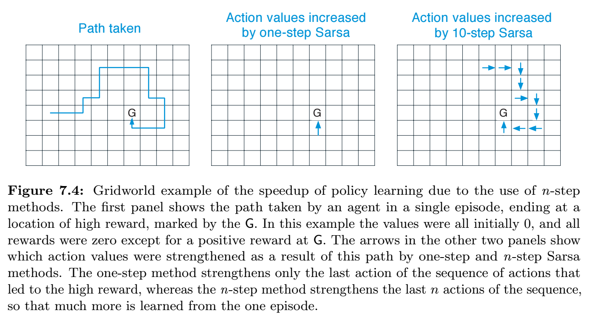

本章探討如何結合 Monte Carlo (MC) 與 temporal difference (TD)。



## n-step TD Prediction

比較 MC 與 TC 之間的差異。

考慮如何從以 $\pi$ 產生的 episodes 預估 $v_{\pi}$：
- MC: 根據整個 episode 的所有 states 進行更新
- 1-step TD: 只根據下一個 state 進行更新
- n-step TD: 介於兩者的中間，根據下 n 個 state 進行更新
- $\infty$-step TD: 等同於 MC

n-step 的 backup diagram 如下:

- 空心: state
- 實心: action
- 方形: 中止狀態

考慮到如何估計 $S_{t}, R_{t+1}, S_{t+1}, R_{t+2}, \ldots, R_{T}, S_{T}$ 的 value:

已知 MC 的更新式如下：
$$
G_{t} \doteq R_{t+1}+\gamma R_{t+2}+\gamma^{2} R_{t+3}+\cdots+\gamma^{T-t-1} R_{T}
$$

其中 $T$ 是最後一個 time step。在此，稱這個量為更新的 **目標** (the **target** of the update)。

1-step TD 的更新目標如下：
$$
G_{t: t+1} \doteq R_{t+1}+\gamma V_{t}\left(S_{t+1}\right)
$$
其中 $V_{t}: \mathcal{S} \rightarrow \mathbb{R}$ 代表 $v_{\pi}$ 在時間 $t$ 時的估計值。

2-step TD 的更新目標可以推廣如下：
$$
G_{t: t+2} \doteq R_{t+1}+\gamma R_{t+2}+\gamma^{2} V_{t+1}\left(S_{t+2}\right)
$$

以此類推，n-step TD 更新目標如下：
$$
G_{t: t+n} \doteq R_{t+1}+\gamma R_{t+2}+\cdots+\gamma^{n-1} R_{t+n}+\gamma^{n} V_{t+n-1}\left(S_{t+n}\right)
$$
對所有 $n, t$ 使得 $n \ge 1$ 且 $0 \le t \le T-n$。

所有的 n-step 的 returns 都可以被視為用來近似於 "所有的 returns"，近似的部份為 $V_{t+n-1}(S_{t+n})$。如果 $t+n \ge T$ (亦即：n-step 會考慮到超出中止狀態之後的狀態) 則少掉的項會設定為 0。 

注意：當 $n \gt 1$ 時，n-step returns 會涉及未來的 rewards，所以要到 $t+n$ 後採樣到才能夠計算 $R_{t+n}$ 和 $V_{t+n-1}$。使用 n-step returns 的 state-value 學習演算法如下：
$$
V_{t+n}\left(S_{t}\right) \doteq V_{t+n-1}\left(S_{t}\right)+\alpha\left[G_{t: t+n}-V_{t+n-1}\left(S_{t}\right)\right], \quad 0 \leq t<T
$$
同時，對於所有 $s \ne S_{t}$ 的 state-value 都保持不變。

### Error reduction property

n-step returns 使用 $V_{t+n-1}$ 來近似在 $R_{t+n}$ 之後的未知的 rewards。一個重要的性質是：在最糟的狀態下，n-step returns 的期望值保證會比 $V_{t+n-1}$ 更好：

$$
\max_ {s}\left|\mathbb{E}_ {\pi}\left[G_ {t: t+n} \mid S_ {t}=s\right]-v_ {\pi}(s)\right| \leq \gamma^{n} \max _ {s}\left|V_ {t+n-1}(s)-v_ {\pi}(s)\right|
$$

對所有 $n \ge 1$。

這個性質稱為 **error reduction property**。這個性質可以說明所有的 n-step 方法都收斂到正確的預測值 (predictions)。

### Example 7.1: n-step TD Methods on the Random Walk

參考 [Example 6.2](/RL-notes/sutton/tabular-solution-methods/temporal-difference-learning/#example-62)，以下探討設定多少的 n 結果最好。實驗設定：
- 參數 $n$ 與 $\alpha$
- 計算前 10 個 episodes 的結果
- 實驗重複執行 100 次取平均

結果如下圖：

從這個實驗可以知道，n-step 有機會比兩個極端 (1-step TD 與 MC) 結果更好。

## n-step Sarsa

如何將 n-step 方法從 prediction 推廣到 control?
- 將 states 改成 actions
- 使用 $\varepsilon$-greedy

將 n-step returns 重新定義如下:
$$
G_ {t: t+n} \doteq R_ {t+1}+\gamma R_ {t+2}+\cdots+\gamma^{n-1} R_ {t+n}+\gamma^{n} Q_ {t+n-1}\left(S_ {t+n}, A_ {t+n}\right), \quad n \geq 1,0 \leq t<T-n
$$
with $G_ {t: t+n} \doteq G_ t$ if $t+n \gt T$. The natural algorithm is then
$$
Q_ {t+n}\left(S_ {t}, A_ {t}\right) \doteq Q_ {t+n-1}\left(S_ {t}, A_ {t}\right)+\alpha\left[G_ {t: t+n}-Q_ {t+n-1}\left(S_ {t}, A_ {t}\right)\right], \quad 0 \leq t<T
$$
對於其他的 states，其 values 維持不變:
$Q_ {t+n}(s,a) = Q_ {t+n-1}(s,a)$ 對所有 $s \neq S_ t$ or $a \neq A_ t$

演算法如下:

- 除了 G 以外的所有的網格初始 values 為 0
- 左圖表示一條路徑
- 中右兩圖表示這條路徑中的哪個 action values 會被加強
- 中圖為 1-step Sarsa
- 右圖為 n-step Sarsa
- 從圖上結果可以得知，1-step Sarsa 只會強化最後一個 action，而 n-step Sarsa

n-step return of Sarsa 可以被寫成一種 TD error 的形式如下:
$$
G_{t: t+n}=Q_{t-1}\left(S_{t}, A_{t}\right)+\sum_{k=t}^{\min (t+n, T)-1} \gamma^{k-t}\left[R_{k+1}+\gamma Q_{k}\left(S_{k+1}, A_{k+1}\right)-Q_{k-1}\left(S_{k}, A_{k}\right)\right]
$$

Expected Sarsa: 包含一個類似於 n-step Sarsa 的 actions/states 序列，還有在最後有一個分支，其中包含所有動作的機率

$$
G_ {t: t+n} \doteq R_ {t+1}+\cdots+\gamma^{n-1} R_ {t+n}+\gamma^{n} \bar{V}_ {t+n-1}\left(S_ {t+n}\right), \quad t+n<T
$$
with $G_ {t: t+n} \doteq G_ t$ if $t+n \gt T$. 其中，$\bar{V}_ {t}(s)$ 是 state $s$ 的 expected approximate value (近似期望值)。在 target policy 中計算如下:
$$
\bar{V}_ {t}(s) \doteq \sum_ {a} \pi(a \mid s) Q_ {t}(s, a), \quad \text { for all } s \in \mathcal{S}
$$

Expected approximate value 在本書後面會有更多討論。當 $s$ 為中止狀態時，它的 expected approximate value 定義為 0。

## n-step Off-policy Learning

Off-policy: 學習 target policy $\pi$ 的 value function，同時會利用 behavior policy $b$。一個簡單的 n-step off-policy 可以定義如下：

$$
V_{t+n}\left(S_{t}\right) \doteq V_{t+n-1}\left(S_{t}\right)+\alpha \rho_{t: t+n-1}\left[G_{t: t+n}-V_{t+n-1}\left(S_{t}\right)\right], \quad 0 \leq t<T,
$$
- 其中，$\rho_{t:t+n-1}$ 是 importance sampling ratio，為兩個 policies 採樣 action 的相對機率 (relative probability)，定義如下：

類似的，n-step Sarsa 可以定義如下：

$$
\rho_{t: h} \doteq \prod_{k=t}^{\min (h, T-1)} \frac{\pi\left(A_{k} \mid S_{k}\right)}{b\left(A_{k} \mid S_{k}\right)}
$$

注意：importance sampling ratio 開始和結束的時間點都比前項還要多一個 step，這是因為這裡更新的是一個 state-action pair，所以我們不關心當前被採樣的 action，而是在採樣該 action 之後的 actions。

## Per-decision Methods with Control Variates

n-step off-policy 方法夠簡潔，但可能不是最有效率的。

n-step return 經由 h 個時長 (horizon) 可以被下式來描述：

$$
G_{t: h}=R_{t+1}+\gamma G_{t+1: h}, \quad t<h<T,
$$

- 其中，$G_{h: h} \doteq V_{h-1} (S_h)$

Importance sampling ratio:

$$
\rho_{t}=\frac{\pi\left(A_{t} \mid S_{t}\right)}{b\left(A_{t} \mid S_{t}\right)}
$$

Off-policy return 的計算方式，一種是可以簡單的乘上 importance sampling ratio。問題是，當某些 target policy 沒有採樣到的動作時，其 $\rho = 0$，這會造成很大的變異性。第二種計算方式如下：

$$
G_{t: h} \doteq \rho_{t}\left(R_{t+1}+\gamma G_{t+1: h}\right)+\left(1-\rho_{t}\right) V_{h-1}\left(S_{t}\right), \quad t<h<T,
$$

- 其中，$G_{h: h} \doteq V_{h-1} (S_h)$。

這稱為 **control variate**。

對於 action-values 形式，計算如下：

$$
\begin{aligned}
G_ {t: h} & \doteq R_ {t+1}+\gamma\left(\rho_ {t+1} G_ {t+1: h}+\bar{V}_ {h-1}\left(S_ {t+1}\right)-\rho_ {t+1} Q_ {h-1}\left(S_ {t+1}, A_ {t+1}\right)\right), \newline
&=R_ {t+1}+\gamma \rho_ {t+1}\left(G_ {t+1: h}-Q_ {h-1}\left(S_ {t+1}, A_ {t+1}\right)\right)+\gamma \bar{V}_ {h-1}\left(S_ {t+1}\right), \quad t<h \leq T .
\end{aligned}
$$

## A Unifying Algorithm: n-step $Q(\sigma)$

目前考慮了三種 action-value 演算法：
- $n$-step Sarsa: 有所有的 sample transitions
- tree-backup 演算法: 有所有的 state-to-action transitions 的未採樣的所有分支
- $n$-step Expected Sarsa: 有所有的 sample transitions 除了最後一個 state-to-action

