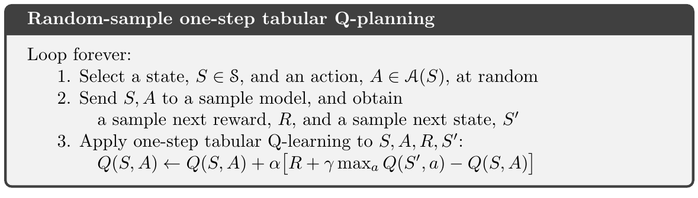



這一章的目標是要統一兩類 RL 方法
- model-based
  - dynamic programming, heuristic search
  - planning
- model-free
  - Monte Carlo, temporal-difference
  - learning

## Models and Planning

Model
- distribution models: 產生所有可能性的機率
  - e.g. in dynamic programming (MDP's dynamics, $p(s', r | s, a)$)
- sample models: 採樣其中一種可能的樣本
  - e.g. the blackjack example in Ch 5.

Distribution models 比 sample models 還要強，sample models 比較容易實作。

Models 可以用來 模仿 (mimic) 或是 模擬 (simulate) 經驗 (experience)。給定起始的狀態和動作，一個 sample model 產生一個可能的轉移 (transition)，而一個 distribution model 產生所有可能的轉移和對應的機率值作為權重。

Planning 指涉任何 把模型當作輸入、輸出或是改善策略來和環境模型互動 的計算過程：


graph LR
    A((model)) -- planning --> B((policy))


在人工智慧領域，有兩種不同的方式來進行 planning:
- state-space planning: 搜尋狀態空間 (state space)
- plan-space planning: 轉換 plan，並且 value function 是定義在 plan 的空間上。
  - e.g. 演化式方法、partial-order planning
  - 難以應用在隨機性的連續決策問題上 (RL 主要探討的)，所以在本書不會進一步討論。

所有的 state-space planning 共通的結構:
- 所有的 state-space planning 涉及計算 value functions 當作關鍵的中間步驟來改善 policy
- 藉由 update 或是 backup 來計算 value functions


graph LR
    A((model)) --> B((simulated experience)) -- backups --> C((values)) --> D((policy))


Learning 與 planning 的核心是 藉由 backing-up update 操作來估計 value functions。不同之處在於:
- planning 使用模型模擬產生出來的 experience
- learning 使用環境真實的 experience

以下展示了一個基於 planning 的 one-step tabular Q-learning 以及隨機從 sample model 採樣的例子，稱為 **random-sample one-step tabular Q-planning**:

除了提供統一 planning 和 learning 的視角之外，本章第二個主題是尋找小步更新的 planning 方法，會比純 planning 更有效率。
