Temporal-difference (TD) learning 是一個 RL 新穎且重要的觀念，它結合 Monte Carlo 和 dynamic programming (DP) 的想法。
- Monte Carlo: 類似於 Monte Carlo，TD 法可以直接從原始經驗學習，而不需要環境模型。
- DP: 類似於 DP，TD 法可以從另一個已學習的估計來更新估計值，而不用等最後結果。



## TD Prediction

一個 every-visit Monte Carlo 適用於 nonstationary 的環境，value function 更新如下：

$$
V\left(S_ {t}\right) \leftarrow V\left(S_ {t}\right)+\alpha\left[G_ {t}-V\left(S_ {t}\right)\right]
$$
- $G_ t$: return following $t$
- $\alpha$: step-size

這個稱為 constant-$\alpha$ MC。Monte Carlo 法必須等到 episode 結束以後才能更新 $V(S_ t)$。因此，TD 法概念是希望可以在每個 time step 都能進行更新。最簡單的 TD 形式如下：

$$
V\left(S_ {t}\right) \leftarrow V\left(S_ {t}\right)+\alpha\left[R_ {t+1}+\gamma V\left(S_ {t+1}\right)-V\left(S_ {t}\right)\right]
$$

稱為 TD(0) 或 one-step TD。因為 TD(0) 基於現有的估計值進行更新，所以它是一種 bootstrapping 法，像是 DP。

比較：
- Monte Carlo: 更新的目標是 $G_ t$
- TD: 更新的目標是 $R_ {t+1} + \gamma V(S_ {t+1})$

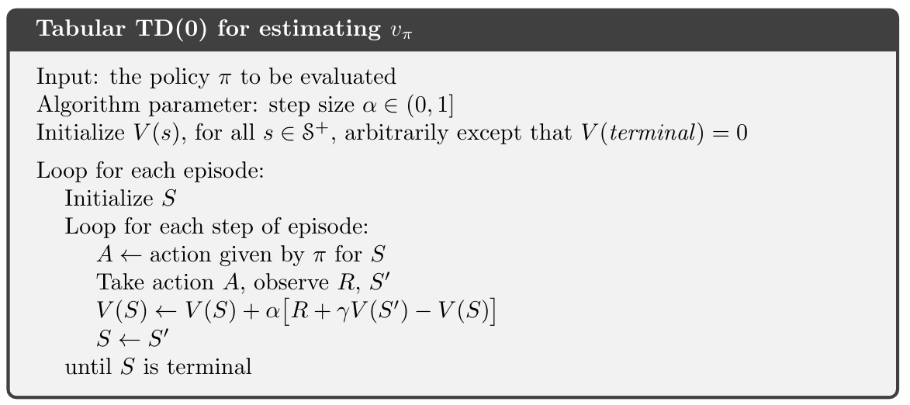

$$
\begin{aligned}
v_ {\pi}(s) & \doteq \mathbb{E}_ {\pi}\left[G_ {t} \mid S_ {t}=s\right] \newline
&=\mathbb{E}_ {\pi}\left[R_ {t+1}+\gamma G_ {t+1} \mid S_ {t}=s\right] \newline
&=\mathbb{E}_ {\pi}\left[R_ {t+1}+\gamma v_ {\pi}\left(S_ {t+1}\right) \mid S_ {t}=s\right]
\end{aligned}
$$
- Monte Carlo 使用第一式的估計值當作目標。因為
- DP 使用第三式的估計值當作目標

... (?)

TD(0) 更新值是一種誤差，這個值稱為 TD error:

$$
\delta_ {t} \doteq R_ {t+1}+\gamma V\left(S_ {t+1}\right)-V\left(S_ {t}\right)
$$

- TD error 每個時刻的當下產生。但 TD error 相依於下次的 state 和 reward，它要到下一個 time step 才會存在。
- 如果 $V$ 在 episode 期間不會改變，那麼 Monte Carlo error 可以寫成 TD error 的和：

$$
\begin{aligned}
G_ {t}-V\left(S_ {t}\right) &=R_ {t+1}+\gamma G_ {t+1}-V\left(S_ {t}\right)+\gamma V\left(S_ {t+1}\right)-\gamma V\left(S_ {t+1}\right) \quad(\text { from }(3.9)) \newline
&=\delta_ {t}+\gamma\left(G_ {t+1}-V\left(S_ {t+1}\right)\right) \newline
&=\delta_ {t}+\gamma \delta_ {t+1}+\gamma^{2}\left(G_ {t+2}-V\left(S_ {t+2}\right)\right) \newline
&=\delta_ {t}+\gamma \delta_ {t+1}+\gamma^{2} \delta_ {t+2}+\cdots+\gamma^{T-t-1} \delta_ {T-1}+\gamma^{T-t}\left(G_ {T}-V\left(S_ {T}\right)\right) \newline
&=\delta_ {t}+\gamma \delta_ {t+1}+\gamma^{2} \delta_ {t+2}+\cdots+\gamma^{T-t-1} \delta_ {T-1}+\gamma^{T-t}(0-0) \newline
&=\sum_ {k=t}^{T-1} \gamma^{k-t} \delta_ {k}
\end{aligned}
$$

- 如果 $V$ 在 episode 期間會改變，這個等式就不精確，不過 step size 夠小的話還是很接近。

## Advantages of TD Prediction Methods

TD 與 DP 相比的優勢：
- 不需要環境模型 (model of environment)

TD 與 Monte Carlo 相比的優勢：
- Monte Carlo 必須等待整個 episode 結束以後才能進行計算

收歛性：對任意固定的 policy $\pi$，如果某個常數的 step-size 參數足夠的小，TD(0) 平均會收斂到 $v_ {\pi}$。如果 step-size 參數根據以下 **隨機近似條件** (stochastic approximation conditions) 進行減少，則收斂的機率是 $1$：

$$
\sum_ {n=1}^{\infty} \alpha_ {n}(a)=\infty \quad \text { and } \quad \sum_ {n=1}^{\infty} \alpha_ {n}^{2}(a)<\infty
$$

TD 和 Monte Carlo 都能保證收斂的情況下，哪個收斂得更快？
- 這還是一個開放問題，目前沒有數學方法證明出來。
- 實務上，在隨機的任務上 TD 法通常比 constant-$\alpha$ MC 收斂得更快。

### Example 6.2

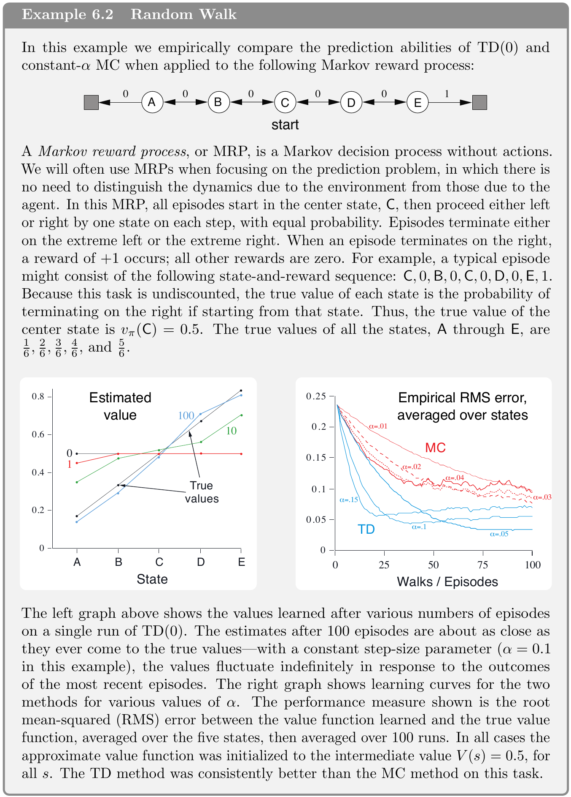

## Optimality of TD(0)

### Batch updating

假設在有限個 episodes。這種情況下，有一種常見的訓練策略：\
利用 (6.1) or (6.2) 的 value function 更新式先對每個 time step $t$ 進行增量計算，最後把整個結果加總後更新 value function 一次。更新完畢以後，再重複以上的過程直到收斂。這個方法稱為批次更新 (batch updating)。
- 只要 step-size 足夠小，TD(0) 就會收斂到一個確定的解。
- 然而，constant-$\alpha$ MC 也會確定性的收斂，但有不同的解。

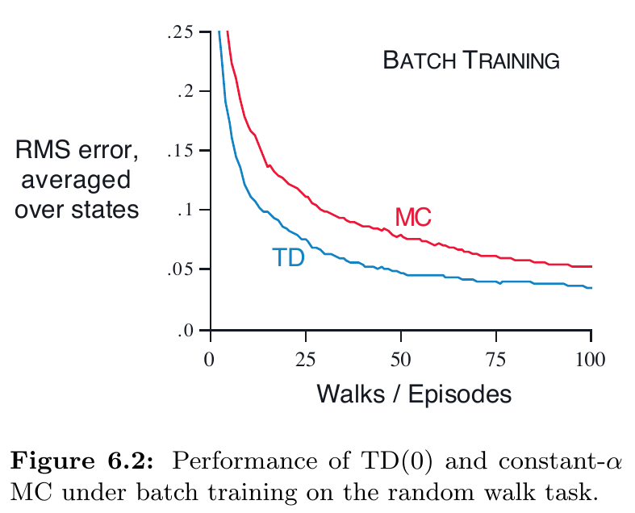

Figure 6.2 展示了利用 batch updating 進行 Example 6.2 的結果。TD 的結果總是比 MC 更好，因為 TD 更相關於預測 returns。

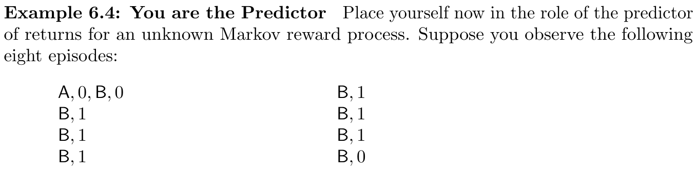

給定以上的 state-rewards，那麼 $V(A)$ 和 $V(B)$ 為何？
- 有些人可能會認同 $V(B)=\frac{3}{4}$，因為 $\frac{6}{8}$ 個 returns 為 $1$，剩下的為 $0$。
- $V(A)$ 則有兩種可能：
  - 根據觀察，$A$ 總是轉移到 $B$，而 $V(B)=\frac{3}{4}$，因此 $V(A)=V(B)=\frac{3}{4}$。可以把它視為一種 Markov process，結果如下圖。這也是 batch TD(0) 計算的結果。
  - 另一種方式，則是簡單的認為 $A$ 只看過一次且產生出 reward 為 $0$ 的結果，因此 $V(A)=0$。這是 batch MC 的結果。注意到這也會產生最小的訓練誤差，但我們會期望認為第一個答案會更好。如果這個是 Markov process，將會預期在未來的資料產生更小的誤差，而 MC 則會在已知的訓練資料產生較小的誤差。

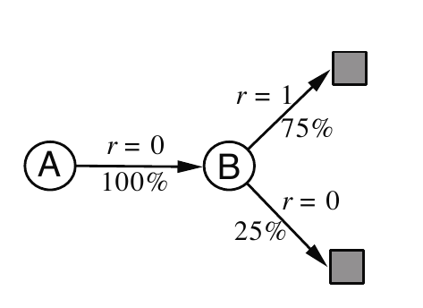

更進一步說明兩種方法的差異：
- batch MC: 總是找到最小的訓練誤差。
- batch TD(0): 總是找到正確的 **maximum-likelihood**。
  - Maximum-likelihood estimate 的參數，是會使得產生這些資料的機率為最大值的。
  - Maximum-likelihood estimate 是 Markov process 的模型：
    - 預測 從 $i$ 到 $j$ 的轉移機率是觀測到所有從 $i$ 到 $j$ 的轉移的分數 (fraction)
    - 對應的 reward 期望值是這些轉移所產生的 rewards 的平均值。
  - 在這個模型下，如果模型絕對正確，我們就可以計算絕對正確的 value function。
  - 這稱為 **certainty-equivalence estimate** (確定等值估計)。
  - 通常 batch TD(0) 會收練到這個 certainty-equivalence estimate。

複雜度：如果有 $n$ 個狀態，
- 形成 maximum-likelihood estimate 需要 $O(n^2)$ 記憶體
- 計算 value function 需要 $O(n^3)$ 的複雜度。

## Sarsa: On-policy TD Control

現在來探討如何使用 TD prediction 來解決 control problem.

確保收歛性的定理也適用於 action values，如下:

$$
Q\left(S_ {t}, A_ {t}\right) \leftarrow Q\left(S_ {t}, A_ {t}\right)+\alpha\left[R_ {t+1}+\gamma Q\left(S_ {t+1}, A_ {t+1}\right)-Q\left(S_ {t}, A_ {t}\right)\right]
$$

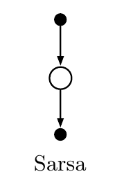

收歛性：
- 只要所有 state-action pairs 都以無限次數經歷過，sarsa 會以 $1$ 的機率收斂到 optimal policy 和 action-value function，並且 policy 收斂到 greedy policy 的極限 (converges in the limit to the greedy policy)。

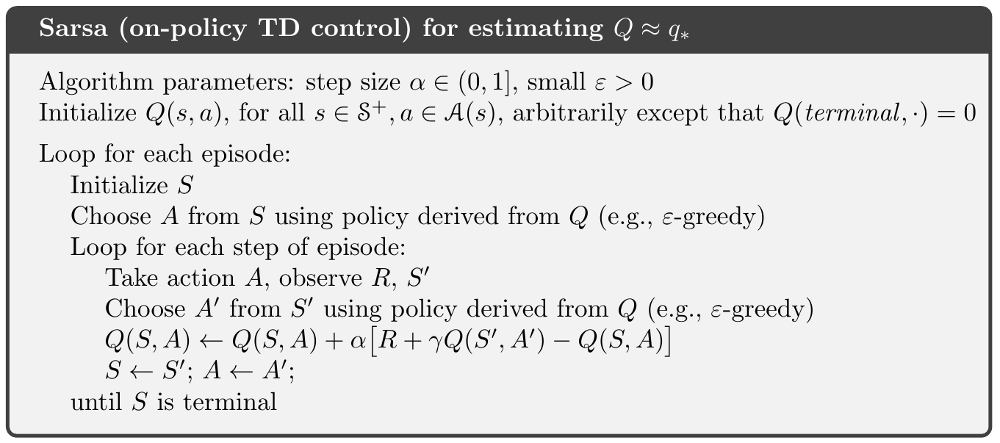

## Q-learning: Off-policy TD Control

Q-learning 的更新式定義如下：

$$
Q\left(S_ {t}, A_ {t}\right) \leftarrow Q\left(S_ {t}, A_ {t}\right)+\alpha\left[R_ {t+1}+\gamma \max _ {a} Q\left(S_ {t+1}, a\right)-Q\left(S_ {t}, A_ {t}\right)\right]
$$

要被學習的 action-value function $Q$ 直接近似 optimal action-value function $q_ *$，更新過程與 policy 無關。
- Policy 決定哪個 state-action pairs 要被經歷。
- 為了要正確的收斂，所有的 pairs 都要連續的被更新。

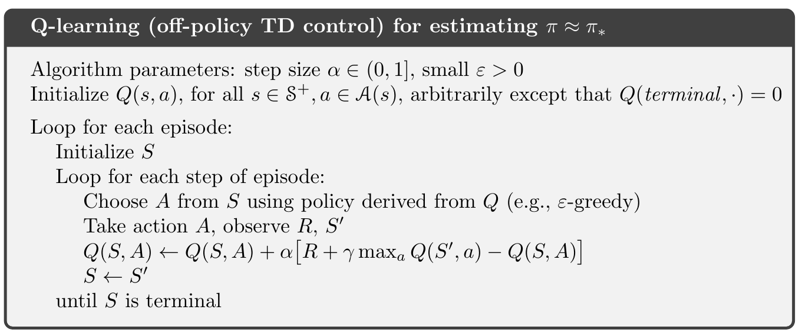

### Example 6.6: Cliff Walking

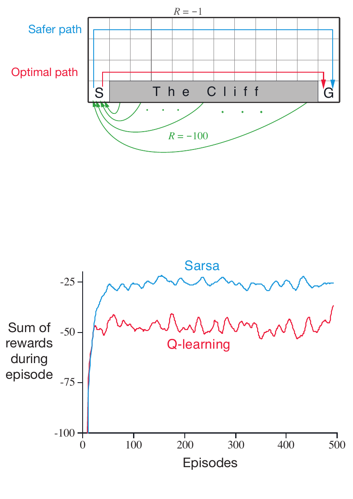

Reward:
- 在 The Cliff 時: $-100$
- 其他: $-1$

比較:
- Sarsa
- Q-learning + $\varepsilon$-greedy with $\varepsilon = 0.1$

結果：
- Sarsa: 走了較安全的路，儘管走了較長的路。
- Q-learning: 學習到 optimal policy，但是 online performance 較差。

## Expected Sarsa

把尋找 **最大** 的 value 改為尋找其 **期望值**，如下：

$$
\begin{aligned}
Q\left(S_ {t}, A_ {t}\right) & \leftarrow Q\left(S_ {t}, A_ {t}\right)+\alpha\left[R_ {t+1}+\gamma \mathbb{E}_ {\pi}\left[Q\left(S_ {t+1}, A_ {t+1}\right) \mid S_ {t+1}\right]-Q\left(S_ {t}, A_ {t}\right)\right] \newline
& \leftarrow Q\left(S_ {t}, A_ {t}\right)+\alpha\left[R_ {t+1}+\gamma \sum_ {a} \pi\left(a \mid S_ {t+1}\right) Q\left(S_ {t+1}, a\right)-Q\left(S_ {t}, A_ {t}\right)\right]
\end{aligned}
$$

這稱為 **Expected Sarsa**。
- 計算量更大
- 消除選擇動作的變異性

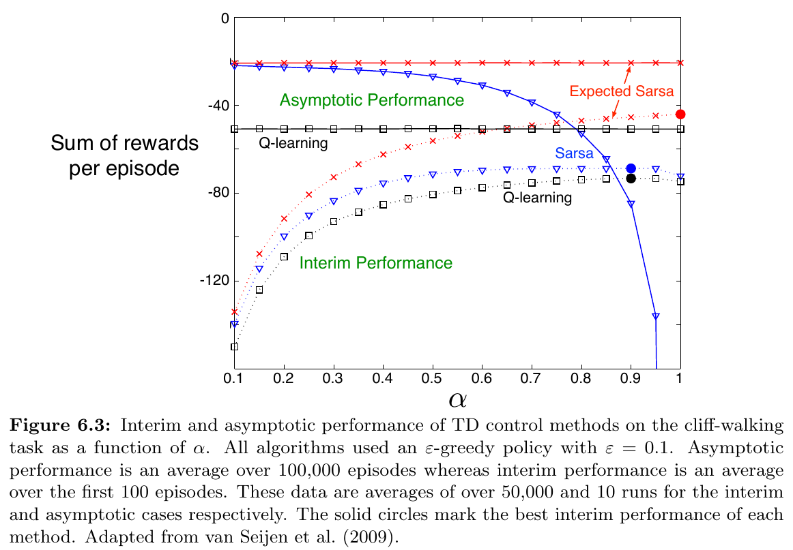
- Asymptotic: $100000$ episodes 並實驗 10 次的平均
- Interim: $100$ episodes 並實驗 50000 次的平均

討論：
- 在走懸崖的例子，狀態轉移都是確定性的，所有的隨機性來自選擇動作。
- 因此，Expected Sarsa 可以安全的設定為 $\alpha = 1$ 而不會減少任何效能。
- 相對來說，Sarsa 只能用在長期且很小的 $\alpha$，效果也比較差。

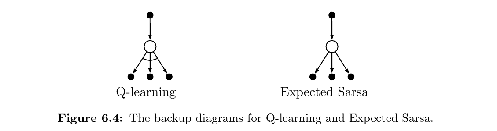

## Games, Afterstates, and Other Special Cases

這本書嘗試提出一個通用的方法來處理廣大的應用情境，不過總是會有必須特別對待的例子。
- 通用的目標是尋找 action-value，不過第一章使用 state-value 來進行 tic-tac-toe 遊戲
- 更仔細來看，一般學習到的 function 不是 action-value 也不是 state-value
  - 傳統的 state-value function 評估一個 state 在 agent 有選擇動作的選項時
  - tic-tac-toe 的 state-value function 評估其狀態在 agent 移動之後。稱為 **afterstates**。

Afterstates 好用在當我們得知 *一部分* 環境的動態 (dynamics) 而不必是 *所有的*。
- 例如：下棋的時候我們會知道每一個落子之後的位置，但不知道對手如何應對。
- Afterstates value function 更有效的處理這類問題。

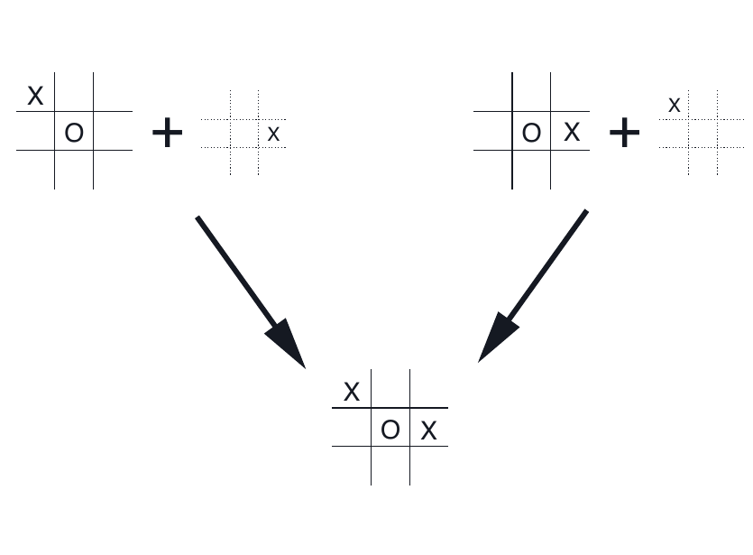
- 這個例子中，下面的結果都來自上面兩種落子順序。
- 傳統的方法會個別計算上面兩種落子的 action-value
- 但是 afterstates 可以馬上發現這兩種情況是相同的

Afterstates 其他應用
- queuing tasks:
  - 指派 customers 給 servers
  - 拒絕 customers
  - 丟棄資訊

## Summary

Temporal-difference (TD)
- prediction problem
- control problem
  - GPI 

TD control
- on-policy
  - Sarsa
- off-policy
  - Q-learning
  - expected Sarsa
- actor-critic (Ch. 13)
